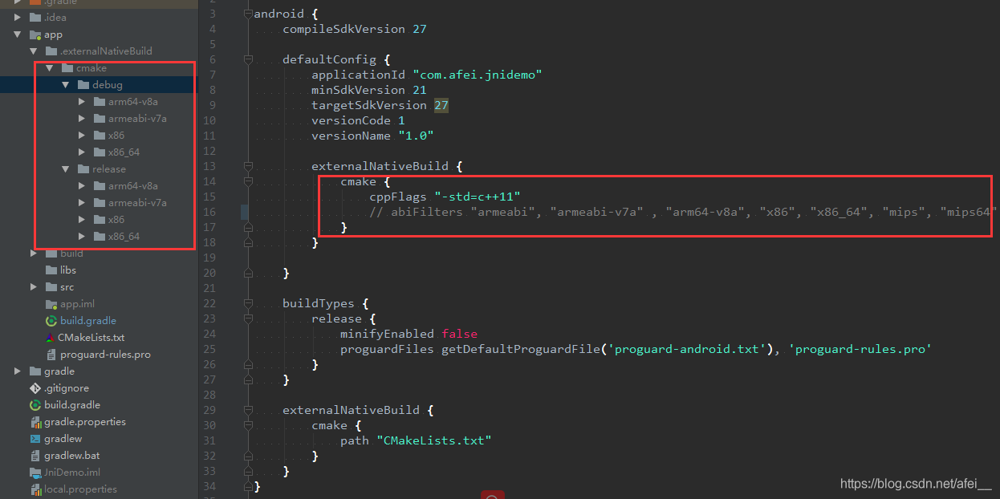
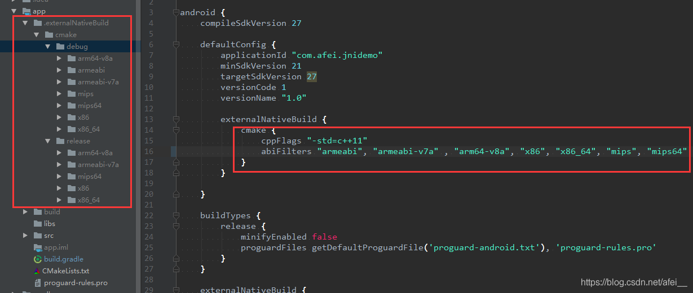
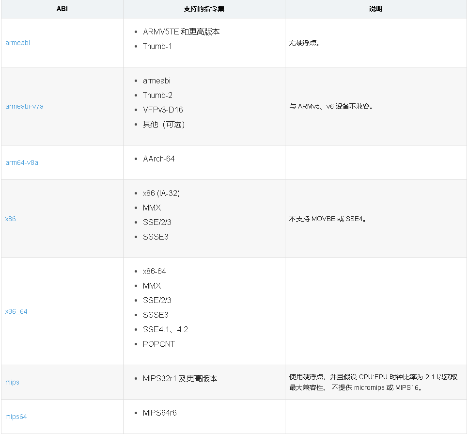

# Android Studio gardle 配置 ndk 指定 ABI： abiFilters 详解

[Android](https://blog.csdn.net/afei__/category_6239255.html)
同时被 2 个专栏收录
82 篇文章25 订阅
订阅专栏

Android NDK 学习
19 篇文章51 订阅
订阅专栏

## 一、ABI 是什么 ##

ABI 是 Application Binary Interface 的缩写。

不同 Android 手机使用不同的 CPU，因此支持不同的指令集。CPU 与指令集的每种组合都有其自己的应用二进制界面（或 ABI）。 ABI 可以非常精确地定义应用的机器代码在运行时如何与系统交互。 您必须为应用要使用的每个 CPU 架构指定 ABI。

**典型的 ABI 包含以下信息：**

- 机器代码应使用的 CPU 指令集。
- 运行时内存存储和加载的字节顺序。
- 可执行二进制文件（例如程序和共享库）的格式，以及它们支持的内容类型。
- 用于解析内容与系统之间数据的各种约定。这些约定包括对齐限制，以及系统如何使用堆栈和在调用函数时注册。
- 运行时可用于机器代码的函数符号列表 通常来自非常具体的库集。

## 二、如何在 gardle 中配置 ##

默认情况下，cmake 会输出 4 种 ABI（"armeabi-v7a" , "arm64-v8a", "x86", "x86_64"），如下所示：

我们也可以通过 abiFilters 来指定我们需要的 ABI：

abiFilters "armeabi", "armeabi-v7a" , "arm64-v8a", "x86", "x86_64", "mips", "mips64"

## 三、支持的 ABI 详解 ##

ABI    支持的指令集    说明
armeabi    
ARMV5TE 和更高版本
Thumb-1
无硬浮点。
armeabi-v7a    
armeabi
Thumb-2
VFPv3-D16
其他（可选）
与 ARMv5、v6 设备不兼容。
arm64-v8a    
AArch-64

x86    
x86 (IA-32)
MMX
SSE/2/3
SSSE3
不支持 MOVBE 或 SSE4。
x86_64    
x86-64
MMX
SSE/2/3
SSSE3
SSE4.1、4.2
POPCNT

mips    
MIPS32r1 及更高版本
使用硬浮点，并且假设 CPU:FPU 时钟比率为 2:1 以获取最大兼容性。 不提供 micromips 或 MIPS16。
mips64    
MIPS64r6

参考：https://developer.android.com/ndk/guides/abis

其它：

​[NDK 学习系列：Android NDK 从入门到精通（汇总篇）](https://blog.csdn.net/afei__/article/details/81290711)

————————————————

版权声明：本文为CSDN博主「阿飞__」的原创文章，遵循CC 4.0 BY-SA版权协议，转载请附上原文出处链接及本声明。

原文链接：https://blog.csdn.net/afei__/article/details/81272251