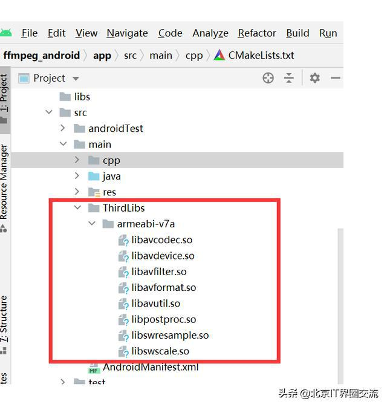
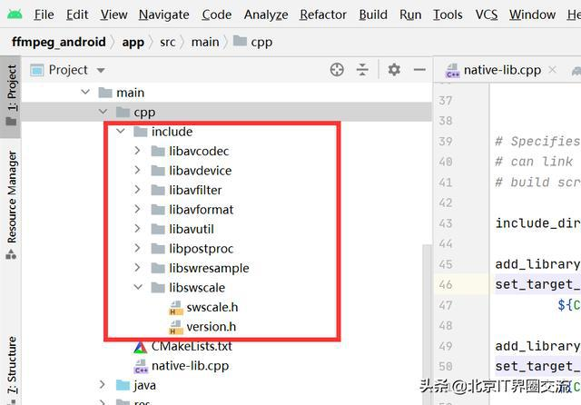

# Android Studio 导入ffmpeg库的最佳实践 #

前面我们介绍如何使用交叉编译方法编译基于android平台ffmpeg库，用来演示第三方C/C++库基于android平台的编译过程。本文将以ffmepg库导入android studio为例，用来演示第三方C/C++库移植到andorid stuio进行实际产品开发的过程。

一、准备ffmpeg库

根据业务需要，ffmpeg 可以编译成arm64-v8a,armabi-v7a,x86,x86-64版本，为了简单起见，我们这里只以armabi-v7a为例，其他版本类似做法。由上一篇文章《基于Android平台的ffmpeg编译》可知，编译的ffmpeg库如下：


armabi-v7a的ffmpeg库

二、创建一个android studio 项目

在图3界面中，双击Create New Project---选择Basic Activity模板---填写工程名和路径名，选择语言native c/c++，即可生成最基本的一个JNI 例子。


创建一个native C/C++工程

三、导入ffmpeg库

1） 修改JNI代码

为了在apk中调用C/C++第三方代码，我们必须借助用JNI接口来调用。即：JAVA-――>JNI---->C/C++第三方代码。


Java调第三方C/C++库原理

我们以在JNI中调用ffmpeg的av_version_info()为例

```
#include <jni.h>
#include <string>

extern "C" {

#include "include/libavutil/avutil.h"

}

extern "C" JNIEXPORT jstring JNICALL

Java_com_example_ffmpeg_1android_MainActivity_stringFromJNI( 
		JNIEnv* env, 
		jobject /* this */) {

	std::string hello = "Hello from C++ by ffmpeg version:"; 

	hello += av_version_info(); 

	return env->NewStringUTF(hello.c_str());
}
```

2) 导入ffmpeg的so库

在main目录下建立一个ThirdLibs目录，将armv7a版本so库导入在该目录下



导入ffmpeg库

3）导入ffmpeg头文件



导入ffmpeg头文件

4）修改Cmakelist.txt编译脚本

```
include_directories(${CMAKE_CURRENT_SOURCE_DIR}/include)

add_library(avcodec SHARED IMPORTED)

set_target_properties(avcodec PROPERTIES IMPORTED_LOCATION ${CMAKE_SOURCE_DIR}/../ThirdLibs/${ANDROID_ABI}/libavcodec.so)

add_library(avdevice SHARED IMPORTED)

set_target_properties(avdevice PROPERTIES IMPORTED_LOCATION ${CMAKE_SOURCE_DIR}/../ThirdLibs/${ANDROID_ABI}/libavdevice.so)

add_library(avfilter SHARED IMPORTED)

set_target_properties(avfilter PROPERTIES IMPORTED_LOCATION ${CMAKE_SOURCE_DIR}/../ThirdLibs/${ANDROID_ABI}/libavfilter.so)

add_library(avformat SHARED IMPORTED)

set_target_properties(avformat PROPERTIES IMPORTED_LOCATION ${CMAKE_SOURCE_DIR}/../ThirdLibs/${ANDROID_ABI}/libavformat.so)

add_library(avutil SHARED IMPORTED)

set_target_properties(avutil PROPERTIES IMPORTED_LOCATION ${CMAKE_SOURCE_DIR}/../ThirdLibs/${ANDROID_ABI}/libavutil.so)

add_library(postproc SHARED IMPORTED)

set_target_properties(postproc PROPERTIES IMPORTED_LOCATION ${CMAKE_SOURCE_DIR}/../ThirdLibs/${ANDROID_ABI}/libpostproc.so)

add_library(swresample SHARED IMPORTED)

set_target_properties(swresample PROPERTIES IMPORTED_LOCATION ${CMAKE_SOURCE_DIR}/../ThirdLibs/${ANDROID_ABI}/libswresample.so)

add_library(swscale SHARED IMPORTED)

set_target_properties(swscale PROPERTIES IMPORTED_LOCATION ${CMAKE_SOURCE_DIR}/../ThirdLibs/${ANDROID_ABI}/libswscale.so)

target_link_libraries(# Specifies the target library. 
	native-lib 
	avcodec 
	avdevice 
	avfilter 
	avformat 
	avutil 
	postproc 
	swresample 
	swscale 
	# Links the target library to the log library 
	# included in the NDK. 
	${log-lib} )

```

5） 修改build.grade

默认apk会去链接各种平台的native 库，这里为了简单起见，只链接armv7a的库。修改如下：

```
cmake { 
		cppFlags '' 
		abiFilters 'armeabi-v7a' 
		} 
	}
}
```

四、 编译生成的apk,安装到手机上，运行OK，效果如下：


APK运行效果图

