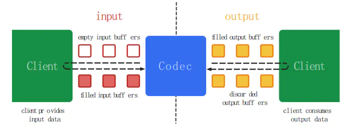
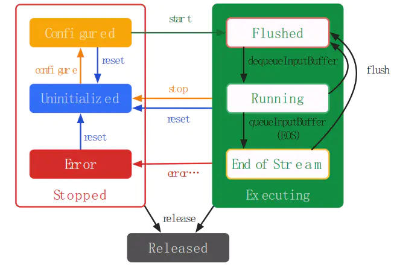

# Android平台MediaCodec避坑指北

最近使用MediaCodec做编解码H264，写一点东西以免自己再次掉坑。  
**先说一下具体环境，使用的是，Windows10 + AndroidStudio3.0 + CMake**  
既然都用了AndroidStudio3.0，就不用android.mk文件啦，直接上CMake。

先上一个，谷歌Android官方链接，可以看到MediaCodec的架构，状态转移图，全部API等。  
https://developer.android.com/reference/android/media/MediaCodec.html  
这个是Android源码media部分，内含MediaCodec，分别在jni和java目录下。  
https://android.googlesource.com/platform/frameworks/base/+/master/media  
这个是Android源码ndk c++ media部分，内含MediaCodec，分别在libmedia，libstagefright，ndk目录下。  
https://android.googlesource.com/platform/frameworks/av/+/master/media/  
这些都要`认真上网`才能看。  
这里有个MediaCodec 中文API文档，文档虽然不是最新版，但是对我们理解还是有帮助的，感谢译者的奉献。  
[Android多媒体--MediaCodec 中文API文档 - 二的次方 - 博客园](https://www.cnblogs.com/roger-yu/p/5635494.html)

### 一、架构介绍

MediaCodec有输入和输入的缓冲区和队列。



MediaCodec的架构

在MediaCodec的生命周期中，存在三种状态：  
Stopped：包含Uninitialized、Configured、Error三种子状态。  
Executing：包含Flushed、Running、End-of-Stream三种子状态。  
Released。



MediaCodec的状态循环

这些在MediaCodec官方文档都有，很多人翻译的很好。我就不多说了。

### 二、调用流程简介

Android从API 16开始提供java层的MediaCodec视频硬解码接口；  
从API 21，也就是Android 5.0开始提供native层的MediaCodec的接口。

Android调用MediaCodec简单流程的是：  
SDK : JavaApi---->JNI---->C++  
NDK：NdkApi----->C++  
这个博客非常详细的讲了这个流程。我就不赘述了。  

[Android Multimedia框架总结（二十一）MediaCodec中创建到start过程(到jni部分)_码农突围的博客-CSDN博客](http://blog.csdn.net/hejjunlin/article/details/53386117)  

[Android Multimedia框架总结（二十二）MediaCodec中C++中创建到start过程及状态变换_码农突围的博客-CSDN博客](http://blog.csdn.net/hejjunlin/article/details/53573819)  

[Android Multimedia框架总结（二十七）MediaCodec回顾_码农突围的博客-CSDN博客](http://blog.csdn.net/hejjunlin/article/details/72859142)  

最后文章有个最后疑惑点

```kotlin
最后疑惑点

在阅读时，还发现有NdkMediaCodec及NdkMediaCodec.cpp这些个class, 和上面几个class的区别是什么？有什么关系？为什么要这么设计？ 
frameworks\av\include\ndk\NdkMediaCodec.h
```

其实这俩就是NDK的Api接口类，这个类最终还是调用的stagefright内的MediaCodec。

### 三、实现方式

**Talk is cheap，show me the code**  
首先要选择的是：使用SDK还是NDK？  
SDK用Java，API16（即Android 4.1）以上的设备都可用。  
NDK用C++，API21（集Android 5.0）以上的设备可支持。

```css
据谷歌2018年1月的Android版本统计数据：
Android4.1及以后的版本，占99.1%，我们可以理解为支持所有在市面上的Android设备。
Android4.1~4.4的版本，占18.4%，Android5.0及以后的版本，占80.7%。
特别是Android4.4，占有率达12.8%，不能忽视。
简单计算一下，Android4.4及以上版本，占93.5%，可以视为支持了绝大多数Android设备。
```

如果使用NDK的话，可能需要考虑下Android4.4的兼容问题，幸好有人从Android4.4源码里抽取了libnative_codec19.so并封装了和NdkMediaCodec一样接口，感谢他的贡献精神。

具体这两种方式，我都要讲讲。

#### MediaCodec接入的准备工作

**从/etc/media_codecs.xml文件里可以看出支持的各种格式，一般来说，又能编码又能解码只有H264。**  
那么我们就以H264来举例，从[MediaCodec reference页面](https://developer.android.com/reference/android/media/MediaCodec.html)得知，H264使用"video/avc"。

```kotlin
### createDecoderByType

added in [API level 16](https://developer.android.com/guide/topics/manifest/uses-sdk-element.html#ApiLevels)

Instantiate the preferred decoder supporting input data of the given mime type. 
The following is a partial list of defined mime types and their semantics:

*   "video/x-vnd.on2.vp8" - VP8 video (i.e. video in .webm)
*   "video/x-vnd.on2.vp9" - VP9 video (i.e. video in .webm)
*   "video/avc" - H.264/AVC video
*   "video/hevc" - H.265/HEVC video
*   "video/mp4v-es" - MPEG4 video
*   "video/3gpp" - H.263 video
*   "audio/3gpp" - AMR narrowband audio
*   "audio/amr-wb" - AMR wideband audio
*   "audio/mpeg" - MPEG1/2 audio layer III
*   "audio/mp4a-latm" - AAC audio (note, this is raw AAC packets, not packaged in LATM!)
*   "audio/vorbis" - vorbis audio
*   "audio/g711-alaw" - G.711 alaw audio
*   "audio/g711-mlaw" - G.711 ulaw audio
```

**Note:** It is preferred to use [findDecoderForFormat(MediaFormat)](https://developer.android.com/reference/android/media/MediaCodecList.html#findDecoderForFormat(android.media.MediaFormat)) and [createByCodecName(String)](https://developer.android.com/reference/android/media/MediaCodec.html#createByCodecName(java.lang.String)) to ensure that the resulting codec can handle a given format.

**①MediaCodec格式支持**  
上一段检测MediaCodec格式支持的代码。

```csharp
private int getSupportColorFormat() {
        int numCodecs = MediaCodecList.getCodecCount();
        MediaCodecInfo codecInfo = null;
        for (int i = 0; i < numCodecs && codecInfo == null; i++) {
            MediaCodecInfo info = MediaCodecList.getCodecInfoAt(i);
            if (!info.isEncoder()) {
                continue;
            }
            String[] types = info.getSupportedTypes();
            boolean found = false;
            for (int j = 0; j < types.length && !found; j++) {
                if (types[j].equals("video/avc")) {
                    System.out.println("found");
                    found = true;
                }
            }
            if (!found)
                continue;
            codecInfo = info;
        }

        Log.e("AvcEncoder", "Found " + codecInfo.getName() + " supporting " + "video/avc");

        // Find a color profile that the codec supports
        MediaCodecInfo.CodecCapabilities capabilities = codecInfo.getCapabilitiesForType("video/avc");
        Log.e("AvcEncoder",
                "length-" + capabilities.colorFormats.length + "==" + Arrays.toString(capabilities.colorFormats));

        for (int i = 0; i < capabilities.colorFormats.length; i++) {

            switch (capabilities.colorFormats[i]) {
                case MediaCodecInfo.CodecCapabilities.COLOR_FormatYUV420SemiPlanar:
                case MediaCodecInfo.CodecCapabilities.COLOR_FormatYUV420Planar:
                case MediaCodecInfo.CodecCapabilities.COLOR_FormatYUV420Flexible:
                    Log.e("AvcEncoder", "supported color format::" + capabilities.colorFormats[i]);
                    break;

                default:
                    Log.e("AvcEncoder", "other color format " + capabilities.colorFormats[i]);
                    break;
            }
        }
        //return capabilities.colorFormats[i];
        return 0;
    }
```

可以由此得知Android设备具体支持的格式数量和格式枚举值。  
这个MediaCodecInfo和MediaCodecList在NDKC++并未暴露出接口，  
所以NDKC++代码不能调用，无法获得Android设备具体支持的格式数量和格式枚举值。  
`（如果有办法调用，或者得知具体支持的格式枚举值，请不吝赐教。）`  
**②Codec输入编码格式**  
得知Android设备具体支持的格式枚举值后，大多数设备都会支持这几种格式。

```java
 public static final class CodecCapabilities {
        /** @deprecated */
        @Deprecated
        public static final int COLOR_FormatYUV420Planar = 19;
        /** @deprecated */
        @Deprecated
        public static final int COLOR_FormatYUV420SemiPlanar = 21;
        public static final int COLOR_FormatYUV422Flexible = 2135042184;
```

```java
public class ImageFormat {
    public static final int DEPTH16 = 1144402265;
    public static final int DEPTH_POINT_CLOUD = 257;
    public static final int FLEX_RGBA_8888 = 42;
    public static final int FLEX_RGB_888 = 41;
    public static final int JPEG = 256;
    public static final int NV16 = 16;
    public static final int NV21 = 17;
    public static final int PRIVATE = 34;
    public static final int RAW10 = 37;
    public static final int RAW12 = 38;
    public static final int RAW_PRIVATE = 36;
    public static final int RAW_SENSOR = 32;
    public static final int RGB_565 = 4;
    public static final int UNKNOWN = 0;
    public static final int YUV_420_888 = 35;
    public static final int YUV_422_888 = 39;
    public static final int YUV_444_888 = 40;
    public static final int YUY2 = 20;
    public static final int YV12 = 842094169;
```

其中:  
CodecCapabilities.COLOR_FormatYUV420Planar，相当于ImageFormat.YV12  
CodecCapabilities.COLOR_FormatYUV420SemiPlanar，相当于ImageFormat.NV21  
（我有一篇写[YUV格式的文章](https://www.jianshu.com/p/3e44c2262775)，详细描述各种格式。）  
但在有些Android设备上，却是UV反过来的:  
CodecCapabilities.COLOR_FormatYUV420Planar是 I420,  
CodecCapabilities.COLOR_FormatYUV420SemiPlanar是 NV12,  
`（暂不清楚原因，望不吝赐教）`

##### MediaCodec SDK接入

①创建Encoder，设置各种参数。

```csharp
    public AvcEncoder(int width, int height, int framerate, int bitrate) { 
        Log.d("Codec", "AvcEncoder IN");
        m_width  = width;
        m_height = height;
        yuv420 = new byte[width*height*3/2];
        try {
            mediaCodec = MediaCodec.createEncoderByType("video/avc");
        } catch (IOException e) {
            e.printStackTrace();
        }
        MediaFormat mediaFormat = MediaFormat.createVideoFormat("video/avc", width, height);
        mediaFormat.setInteger(MediaFormat.KEY_BIT_RATE, bitrate);
        mediaFormat.setInteger(MediaFormat.KEY_FRAME_RATE, framerate);
        mediaFormat.setInteger(MediaFormat.KEY_COLOR_FORMAT, MediaCodecInfo.CodecCapabilities.COLOR_FormatYUV420SemiPlanar);
        mediaFormat.setInteger(MediaFormat.KEY_I_FRAME_INTERVAL, 30);

        mediaCodec.configure(mediaFormat, null, null, MediaCodec.CONFIGURE_FLAG_ENCODE);
        mediaCodec.start();
        Log.d("Codec", "AvcEncoder OUT");
    }
```

②创建Decoder，设置各种参数。

```csharp
    public AvcDecoder(int width, int height, SurfaceHolder surfaceHolder) {
        Log.d("Codec", "AvcDecoder IN");
        try {
            mediaCodec = MediaCodec.createDecoderByType("video/avc");
            MediaFormat mediaFormat = MediaFormat.createVideoFormat("video/avc", width, height);
            nv12 = new byte[width * height * 3 / 2];
            mediaFormat.setInteger(MediaFormat.KEY_COLOR_FORMAT, MediaCodecInfo.CodecCapabilities.COLOR_FormatYUV420SemiPlanar);
            //mediaCodec.configure(mediaFormat, surfaceHolder.getSurface(), null, 0);
            mediaCodec.configure(mediaFormat, null, null, 0);
            mediaCodec.start();
            Log.d("Codec", "AvcDecoder OUT");
        } catch (IOException e) {
            e.printStackTrace();
        }

    }
```

③获取Encoder InputBuffer，输入数据，获取Encoder OutputBuffer，获取输出数据

```csharp
public int offerEncoder(byte[] input, byte[] output) 
    {   
        Log.d("......................................................Codec", "Encoder in");
        int pos = 0;
        yuv420= input;
        try {
            ByteBuffer[] inputBuffers = mediaCodec.getInputBuffers();
            ByteBuffer[] outputBuffers = mediaCodec.getOutputBuffers();
            int inputBufferIndex = mediaCodec.dequeueInputBuffer(-1);
            Log.d("......................................................Codec", "inputBufferIndex = " +inputBufferIndex);
            if (inputBufferIndex >= 0)
            {
                ByteBuffer inputBuffer = inputBuffers[inputBufferIndex];
                inputBuffer.clear();
                inputBuffer.put(yuv420);
                mediaCodec.queueInputBuffer(inputBufferIndex, 0, input.length, 0, 0);
            }

            MediaCodec.BufferInfo bufferInfo = new MediaCodec.BufferInfo();
            int outputBufferIndex = mediaCodec.dequeueOutputBuffer(bufferInfo,0);
            Log.d("......................................................Codec", "outputBufferIndex = " +outputBufferIndex);
            while (outputBufferIndex >= 0) 
            {
                ByteBuffer outputBuffer = outputBuffers[outputBufferIndex];
                byte[] outData = new byte[bufferInfo.size];
                outputBuffer.get(outData);

                if(m_info != null)
                {               
                    System.arraycopy(outData, 0,  output, 0, outData.length);
                    pos += outData.length;
                    Log.d("Encoder", "m_info: " + pos);
                }
                else
                {
                     ByteBuffer spsPpsBuffer = ByteBuffer.wrap(outData);  
                     //if (spsPpsBuffer.getInt() == 0x00000001)
                    if(bufferInfo.flags == 2)
                     {  
                         m_info = new byte[outData.length];
                         System.arraycopy(outData, 0, m_info, 0, outData.length);
                         System.arraycopy(outData, 0, output, pos, outData.length);
                         pos+=outData.length;
                     } 
                     else 
                     {
                         Log.d("Encoder", "errrrr: ");
                            return -1;
                     }
                    Log.d("Encoder", "m_info: " + Arrays.toString(m_info));
                }

                mediaCodec.releaseOutputBuffer(outputBufferIndex, false);
                outputBufferIndex = mediaCodec.dequeueOutputBuffer(bufferInfo, 0);
            }

            if(bufferInfo.flags == 1)// if( nv12[4] == 0x65) //key frame
            {
                Log.d("Encoder", "Key frame");
                System.arraycopy(output, 0,  yuv420, 0, pos);
                System.arraycopy(m_info, 0,  output, 0, m_info.length);
                System.arraycopy(yuv420, 0,  output, m_info.length, pos);
                pos += m_info.length;
            }

        } catch (Throwable t) {
            t.printStackTrace();
        }
        //Log.d("......................................................Codec", "Encoder out");
        return pos;
    }
```

④获取Decoder InputBuffer，输入数据，获取Decoder OutputBuffer，获取输出数据

```csharp
public void onFrame(byte[] buf, int length) {
        ByteBuffer[] inputBuffers = mediaCodec.getInputBuffers();
        ByteBuffer[] outputBuffers = mediaCodec.getOutputBuffers();
        int inputBufferIndex = mediaCodec.dequeueInputBuffer(-1);
        Log.d("Decoder", "inputBufferIndex:  " + inputBufferIndex);
        if (inputBufferIndex >= 0) {
            ByteBuffer inputBuffer = inputBuffers[inputBufferIndex];
            inputBuffer.clear();
            inputBuffer.put(buf, 0, length);
            mediaCodec.queueInputBuffer(inputBufferIndex, 0, length, mCount * 1000000, 0);
            mCount++;
        }

        MediaCodec.BufferInfo bufferInfo = new MediaCodec.BufferInfo();
        int outputBufferIndex = mediaCodec.dequeueOutputBuffer(bufferInfo, 0);
        while (outputBufferIndex >= 0) {
            outputBuffers[outputBufferIndex].get(nv12 , 0 , nv12.length);
            CallbackAdapt.UpdateH264Decode(nv12, outputBufferIndex);
            mediaCodec.releaseOutputBuffer(outputBufferIndex, false);
            outputBufferIndex = mediaCodec.dequeueOutputBuffer(bufferInfo, 0);
        }

    }
```

##### MediaCodec NDK接入

①创建Encoder，Decoder

```cpp
void FrameListener::InitCodec()
    {
#ifndef WIN32
        const char* mime = "video/avc";
        //编码器
        m_encoder = AMediaCodec_createEncoderByType(mime);
        if (m_encoder == NULL)
        {
            LOGE("MediaCodecH264: could not create Encoder");
        }
        AMediaFormat *m_format = AMediaFormat_new();
        AMediaFormat_setString(m_format, AMEDIAFORMAT_KEY_MIME, "video/avc");
        AMediaFormat_setInt32(m_format, AMEDIAFORMAT_KEY_WIDTH, m_lastWidth);
        AMediaFormat_setInt32(m_format, AMEDIAFORMAT_KEY_HEIGHT, m_lastHeight);

        int bitrate = 500000;
        int framerate = 30;
        AMediaFormat_setInt32(m_format, AMEDIAFORMAT_KEY_BIT_RATE, bitrate);
        AMediaFormat_setInt32(m_format, AMEDIAFORMAT_KEY_FRAME_RATE, framerate);
        AMediaFormat_setInt32(m_format, AMEDIAFORMAT_KEY_I_FRAME_INTERVAL, framerate);
        AMediaFormat_setInt32(m_format, AMEDIAFORMAT_KEY_COLOR_FORMAT, 21);
        media_status_t status = AMediaCodec_configure(m_encoder, m_format, NULL, NULL, AMEDIACODEC_CONFIGURE_FLAG_ENCODE);
        if (status != 0)
        {
            LOGE("AMediaCodec_configure() failed with error %i for format %u", (int)status, 21);
        }
        else
        {
            if ((status = AMediaCodec_start(m_encoder)) != AMEDIA_OK)
            {
                LOGE("AMediaCodec_start: Could not start encoder.");
            }
            else
            {
                LOGD("AMediaCodec_start: encoder successfully started");
            }
        }
        AMediaFormat_delete(m_format);

        //解码器
        m_decoder = AMediaCodec_createDecoderByType(mime);
        if (m_decoder == NULL)
        {
            LOGE("MediaCodecH264: could not create Decoder");
        }
        else 
        {
            AMediaFormat *m_format2 = AMediaFormat_new();
            AMediaFormat_setString(m_format2, AMEDIAFORMAT_KEY_MIME, "video/avc");
            AMediaFormat_setInt32(m_format2, AMEDIAFORMAT_KEY_WIDTH, m_lastWidth);
            AMediaFormat_setInt32(m_format2, AMEDIAFORMAT_KEY_HEIGHT, m_lastHeight);
            AMediaFormat_setInt32(m_format2, AMEDIAFORMAT_KEY_COLOR_FORMAT, 21);
            //AMediaFormat_setBuffer(m_format2, "csd-0",sps, sizeof(sps));
            //AMediaFormat_setBuffer(m_format2, "csd-1",pps, sizeof(pps));

            if ((status = AMediaCodec_configure(m_decoder, m_format2, NULL, NULL, 0)) !=
                AMEDIA_OK) {
                LOGD("MediaCodecH264Dec: configuration failure: %i", (int)status);
            }

            if ((status = AMediaCodec_start(m_decoder)) != AMEDIA_OK) {
                LOGD("MediaCodecH264Dec: starting failure: %i", (int)status);
            }
            AMediaFormat_delete(m_format2);
        }
#endif // !WIN32
    }
```

②获取Encoder InputBuffer，然后输入数据，获取Encoder OutputBuffer，然后获取输出数据

```cpp
void FrameListener::Encode()
    {
#ifndef WIN32
        ssize_t ibufidx, obufidx;
        AMediaCodecBufferInfo info;
        size_t bufsize;

        /*First queue input image*/
        uint8_t *buf;

        ibufidx = AMediaCodec_dequeueInputBuffer(m_encoder, TIMEOUT_US);
        if (ibufidx >= 0)
        {
            buf = AMediaCodec_getInputBuffer(m_encoder, ibufidx, &bufsize);
            if (buf)
            {
                memcpy(buf, m_inputNV12, m_YUVSize);
                auto curTime = timeGetTime();
                AMediaCodec_queueInputBuffer(m_encoder, ibufidx, 0, bufsize, curTime, 0);
            }
            else
            {
                LOGD("MediaCodecH264Enc: obtained InputBuffer, but no address.");
            }
        }
        else if (ibufidx == AMEDIA_ERROR_UNKNOWN)
        {
            LOGD("MediaCodecH264Enc: AMediaCodec_dequeueInputBuffer() had an exception");
        }
        //int pos = 0;
        /*Second, dequeue possibly pending encoded frames*/
        while ((obufidx = AMediaCodec_dequeueOutputBuffer(m_encoder, &info, TIMEOUT_US)) >= 0)
        {
            auto oBuf = AMediaCodec_getOutputBuffer(m_encoder, obufidx, &bufsize);
            if (oBuf) 
            {
                if (m_info == NULL)
                {
                    m_infoSize = info.size;
                    m_info = new byte[m_infoSize];
                    if (info.flags == 2 )
                    {
                        memcpy(m_info, oBuf, m_infoSize);
                        LOGD("obBuf %d %d flag:%d offest:%d size:%d", m_infoSize, bufsize, info.flags, info.offset, info.size);
                        char str[256] = {0};
                        for (int i = 0; i < m_infoSize; ++i)
                        {
                            sprintf(str, "%s %d", str, m_info[i]);
                        }
                        LOGD("obBuf %s", str);
                        //pos += m_infoSize;
                        continue;
                    }
                    else
                    {
                        LOGD("errorrr");
                        return;
                    }
                }
                LOGD("m_infoSize %d %d flag:%d offest:%d size:%d", m_infoSize, bufsize, info.flags, info.offset, info.size);

                H264Data *data = new H264Data();
                m_dataList.push_back(data);
                data->flag = info.flags;
                if (info.flags == 1 )   //key frame
                {
                    data->dataPtr = new byte[bufsize + m_infoSize];
                    memcpy(data->dataPtr, m_info, m_infoSize);
                    memcpy(data->dataPtr + m_infoSize, oBuf, bufsize);
                    data->size = bufsize + m_infoSize;
                }
                else
                {
                    data->dataPtr = new byte[bufsize];
                    memcpy(data->dataPtr, oBuf, bufsize);
                    data->size = bufsize;
                }
                LOGD("Out finish");
            }
            AMediaCodec_releaseOutputBuffer(m_encoder, obufidx, false);
        }

        if (obufidx == AMEDIA_ERROR_UNKNOWN) 
        {
            LOGD("MediaCodecH264Enc: AMediaCodec_dequeueOutputBuffer() had an exception, MediaCodec is lost");
            AMediaCodec_stop(m_encoder);
            AMediaCodec_delete(m_encoder);
        }
#endif // !WIN32

    }
```

③获取Decoder InputBuffer，然后输入数据，获取Decoder OutputBuffer，然后获取输出数据

```cpp
void FrameListener::Decode()
    {
#ifndef WIN32
        if (m_decoder == NULL)
        {
            return;
        }
        ssize_t oBufidx = -1;
        size_t bufsize = 0;
        AMediaCodecBufferInfo info;

        uint8_t *buf = NULL;
        ssize_t iBufidx = -1;

        /*First put our H264 bitstream into the decoder*/
        while (!m_dataList.empty())
        {
            iBufidx = AMediaCodec_dequeueInputBuffer(m_decoder, TIMEOUT_US);
            LOGD("decoder iBufidx %d %d", iBufidx, m_dataList.size());
            if (iBufidx >= 0)
            {
                buf = AMediaCodec_getInputBuffer(m_decoder, iBufidx, &bufsize);
                int bufsize = 0;
                auto iter = m_dataList.begin();
                char str[512] = { 0 };
                for (int i = 0; i < 100; ++i)
                {
                    sprintf(str, "%s %d", str, *((*iter)->dataPtr + i));
                }
                LOGD("obBuf after %s", str);
                if (buf)
                {
                    bufsize = (*iter)->size;
                    memcpy(buf, (*iter)->dataPtr, bufsize);
                }

                AMediaCodec_queueInputBuffer(m_decoder, iBufidx, 0, bufsize, timeGetTime(), 0);
                SAFE_DELETE_ARRAY((*iter)->dataPtr);
                m_dataList.erase(iter);
            }
            else if (iBufidx == -1)
            {
                /*                * This is a problematic case because we can't wait the decoder to be ready, otherwise we'll freeze the entire                * video thread.                * We have no other option to drop the frame, and retry later, but with an I-frame of course.                **/
                break;
            }
        }

        /*secondly try to get decoded frames from the decoder, this is performed every tick*/
        oBufidx = AMediaCodec_dequeueOutputBuffer(m_decoder, &info, TIMEOUT_US);
        LOGD("Decoder oBufidx %d", oBufidx);
        while (oBufidx >= 0)
        {
            AMediaFormat *format;
            int color = 0;

            uint8_t *buf = AMediaCodec_getOutputBuffer(m_decoder, oBufidx, &bufsize);

            if (buf == NULL)
            {
                LOGD("MediaCodecH264Dec: AMediaCodec_getOutputBuffer() returned NULL");
                //continue;
            }
            else
            {
                int width = 0, height = 0;
                format = AMediaCodec_getOutputFormat(m_decoder);
                if (format != NULL) 
                {
                    AMediaFormat_getInt32(format, "width", &width);
                    AMediaFormat_getInt32(format, "height", &height);
                    AMediaFormat_getInt32(format, "color-format", &color);

                    AMediaFormat_delete(format);
                }
                if (width != 0 && height != 0)
                {
                    if (color == 21)
                    {
                        LOGD("12121212");
                        //NV12
                        byte* outNV12 = new byte[m_YUVSize];
                        memcpy(outNV12, buf, m_YUVSize);
                        m_outputNV12List.push_back(outNV12);
                    }
                    else
                    {
                        LOGD("unknown format");
                    }
                }
                else
                {
                    LOGD("MediaCodecH264Dec: width and height are not known !");
                }
            }
            AMediaCodec_releaseOutputBuffer(m_decoder, oBufidx, false);

            oBufidx = AMediaCodec_dequeueOutputBuffer(m_decoder, &info, TIMEOUT_US);
            LOGD("Decoder oBufidx %d", oBufidx);
        }

        if (oBufidx == AMEDIA_ERROR_UNKNOWN)
        {
            LOGD("MediaCodecH264Dec: AMediaCodec_dequeueOutputBuffer() had an exception");
        }
#endif // !WIN32
    }
```

##### MediaCodec NDK CMake

Android NDK Sample里面自带一个native-codec的demo，可以参考他的CMakeLists.txt。

```kotlin
cmake_minimum_required(VERSION 3.4.1)

set(CMAKE_CXX_FLAGS "${CMAKE_CXX_FLAGS} -std=c++11 -Wall -UNDEBUG")

add_library(native-codec-jni SHARED
            looper.cpp
            native-codec-jni.cpp)

# Include libraries needed for native-codec-jni lib
target_link_libraries(native-codec-jni
                      android
                      log
                      mediandk
                      OpenMAXAL)
```

一定要加上`mediandk`和`OpenMAXAL`，才能正常使用MediaCodec。

##### 常见坑点FAQ

`假设读者知道H264帧头和NALU`  
1、H264编码首帧，内部存有SPS和PPS信息，需要保留起来，然后，加在每个H264关键帧的前面。  
mediaCodec.dequeueOutputBuffer会返回MediaCodec.BufferInfo，这个和AMediaCodec_dequeueOutputBuffer返回AMediaCodecBufferInfo是一样的。

```cpp
struct AMediaCodecBufferInfo {
    int32_t offset;
    int32_t size;
    int64_t presentationTimeUs;
    uint32_t flags;
};
```

具体见android reference：  
[MediaCodec.BufferInfo &nbsp;|&nbsp; Android Developers](https://developer.android.com/reference/android/media/MediaCodec.BufferInfo.html)  
其中有个字段是flags，它有几种常量情况。  
flags = 4；End of Stream。  
flags = 2；首帧信息帧。  
flags = 1；关键帧。  
flags = 0；普通帧。  
见[MediaCodec &nbsp;|&nbsp; Android Developers](https://developer.android.com/reference/android/media/MediaCodec.html)里面常量部分。

2、dequeueInputBuffer，dequeueOutputBuffer返回值非0  
dequeueInputBuffer返回-1，说明没有拿到可用缓冲区，一般来说下一帧再来请求输入缓冲区。  
dequeueOutputBuffer返回-1，说明没有可用数据。  
然而dequeueOutputBuffer可能连续输入4、5帧，都没有输出，然后一股脑在1帧中，输出4、5个可用输出缓冲区。  
其他异常情况包括`INFO_OUTPUT_FORMAT_CHANGED`，`INFO_OUTPUT_BUFFERS_CHANGED`等  
见[MediaCodec &nbsp;|&nbsp; Android Developers](https://developer.android.com/reference/android/media/MediaCodec.html)里面常量部分。

3、MediaCodec格式不一致  
Android对COLOR_FormatYUV420SemiPlanar和COLOR_FormatYUV420Planar，这两种常见YUV格式并没有做进一步的规定，  
那么问题就来了，420P和420SP分为I420,YV12,NV12,NV21，  
I420: YYYYYYYY UU VV =>YUV420P

YV12: YYYYYYYY VV UU =>YUV420P

NV12: YYYYYYYY UVUV =>YUV420SP

NV21: YYYYYYYY VUVU =>YUV420SP  
有些设备可能是I420+NV12，这两种U都是在前面的，  
有些设备可能是YV12+NV12，这两种V都是在前面的。  
其他的组合，我也不确定有没有。  
反正这个坑，要注意的。

##### 来个Demo

Github  
[GitHub - Denislyl/AndroidMediaCodec](https://github.com/Denislyl/AndroidMediaCodec)  
编码类，解码类

作者：我心若氺  
链接：https://www.jianshu.com/p/5d62a3cf0741  
来源：简书  
著作权归作者所有。商业转载请联系作者获得授权，非商业转载请注明出处。
