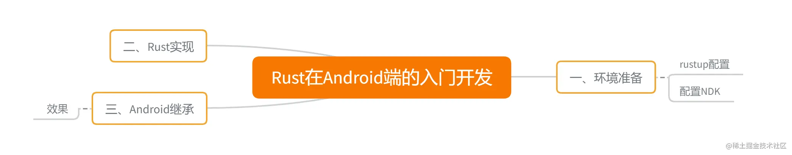

# Rust在Android端的入门开发

# 前言

`IOS`上应用还在半路上，遇到了一些集成问题。在了解、学习过程中发现，`IOS`的`Swifit UI`动画真的是比`Flutter`做的好几倍，后面有时间可以记录记录。本次先记录`Android`集成吧，对比性能的话，可以在`rust`中`for`循环个`10`万次，对比`C`的时间消耗。
 **参考资料**
 [Building and Deploying a Rust library on Android](https://link.juejin.cn?target=https%3A%2F%2Fmozilla.github.io%2Ffirefox-browser-architecture%2Fexperiments%2F2017-09-21-rust-on-android.html)
 [JNI Create](https://link.juejin.cn?target=https%3A%2F%2Fgithub.com%2Fjni-rs%2Fjni-rs%2Fblob%2Fmaster%2Fexample%2Fmylib%2Fsrc%2Flib.rs)
 [Create JNI](https://link.juejin.cn?target=https%3A%2F%2Fdocs.rs%2Fjni%2Flatest%2Fjni%2F)

# 目录



# 一、环境准备

## rustup配置

这个配置，在装rust的时候就配置了，可以忽略。如果没有配置，想了解的可以看[二、Rust入门之Hello World](https://juejin.cn/post/7152882863916974117)

## 配置NDK

**第一步**
 先确定自己的NDK目录
 默认目录一般都在 `/Users/你的用户名/Library/Android/sdk/ndk-bundle` 这个位置，用户目录可以用 `${HOME}` 代替。

**第二步**
 创建库`crate`

```rust
cargo new android_demo --lib
复制代码
```

**第三步**
 切换到 `android_demo` 项目下，创建 `NDK` 文件
 找到 `make_standalone_toolchain.py` 文件，执行以下语句

```java
python D:/Android/SDK/ndk-bundle/build/tools/make_standalone_toolchain.py --api 26 --arch arm64 --install-dir NDK/arm64
python D:/Android/SDK/ndk-bundle/build/tools/make_standalone_toolchain.py --api 26 --arch arm --install-dir NDK/arm
python D:/Android/SDK/ndk-bundle/build/tools/make_standalone_toolchain.py --api 26 --arch x86 --install-dir NDK/x86
复制代码
```

对应的`NDK`目录如下


**第四步**
 找到 `cargo`的配置文件，`~/.cargo/config` 

```rust
[target.aarch64-linux-android]
ar = "E:/VSCodeWorkspace/rust/android_demo/NDK/arm64/bin/aarch64-linux-android-ar"
linker = "E:/VSCodeWorkspace/rust/android_demo/NDK/arm64/bin/aarch64-linux-android-clang"

[target.armv7-linux-androideabi]
ar = "E:/VSCodeWorkspace/rust/android_demo/NDK/arm/bin/arm-linux-androideabi-ar"
linker = "E:/VSCodeWorkspace/rust/android_demo/NDK/arm/bin/arm-linux-androideabi-clang"

[target.i686-linux-android]
ar = "E:/VSCodeWorkspace/rust/android_demo/NDK/x86/bin/i686-linux-android-ar"
linker = "E:/VSCodeWorkspace/rust/android_demo/NDK/x86/bin/i686-linux-android-clang"
复制代码
```

其中 `E:/VSCodeWorkspace/rust/android_demo` 是本次项目目录。

**第五步**
 添加工具链

```rust
rustup target add aarch64-linux-android armv7-linux-androideabi i686-linux-android
复制代码
```

**第六步**
 在当前 `android_demo` 目录下，执行以下语句
 编译`Rust`项目，按需要的架构编译即可。

```rust
cargo build --target aarch64-linux-android --release
cargo build --target armv7-linux-androideabi --release
cargo build --target i686-linux-android --release
复制代码
```

- 出现问题
  - note: %1 不是有效的 Win32 应用程序。 (os error 193) ，第三步和第六步编译不一致。解决方法：将第四步，换成Android SDK 目录下的ndk，看下面代码示例。
  - error: linker `cc` not found,解决方案也是按照下面，一定要使用 .cmd

**解决方案**

```rust
[target.aarch64-linux-android]
ar = "D:\\Android\\SDK\\ndk\\21.4.7075529\\toolchains\\llvm\\prebuilt\\windows-x86_64\\bin\\aarch64-linux-android-ar"
linker = "D:\\Android\\SDK\\ndk\\21.4.7075529\\toolchains\\llvm\\prebuilt\\windows-x86_64\\bin\\aarch64-linux-android26-clang.cmd"

[target.armv7-linux-androideabi]
ar = "D:\\Android\\SDK\\ndk\\21.4.7075529\\toolchains\\llvm\\prebuilt\\windows-x86_64\\bin\\arm-linux-androideabi-ar"
linker = "D:\\Android\\SDK\\ndk\\21.4.7075529\\toolchains\\llvm\\prebuilt\\windows-x86_64\\bin\\armv7a-linux-androideabi26-clang++.cmd"
xxx
复制代码
```

**产物**


# 二、Rust实现

```
Cargo.toml
[package]
name = "android_demo"
version = "0.1.0"
edition = "2021"

# See more keys and their definitions at https://doc.rust-lang.org/cargo/reference/manifest.html

[dependencies]
jni-sys = "0.3.0"

[target.'cfg(target_os="android")'.dependencies]
jni = { version = "0.5", default-features = false }

[lib]
crate-type = ["dylib"]
复制代码
lib.rs
/*
 * @Author: axiong
 */
use std::os::raw::{c_char};
use std::ffi::{CString, CStr};

#[no_mangle]
pub extern fn rust_greeting(to: *const c_char) -> *mut c_char {
    let c_str = unsafe { CStr::from_ptr(to) };
    let recipient = match c_str.to_str() {
        Err(_) => "there",
        Ok(string) => string,
    };

    CString::new("Hello ".to_owned() + recipient).unwrap().into_raw()
}

/// Expose the JNI interface for android below
/// 只有在目标平台是Android的时候才开启 [cfg(target_os="android")
/// 由于JNI要求驼峰命名，所以要开启 allow(non_snake_case)
#[cfg(target_os="android")]
#[allow(non_snake_case)]
pub mod android {
    extern crate jni;

    use super::*;
    use self::jni::JNIEnv;
    use self::jni::objects::{JClass, JString};
    use self::jni::sys::{jstring};

    #[no_mangle]
    pub unsafe extern fn Java_com_rjx_rustdemo_RustGreeting_greeting(env: JNIEnv, _: JClass, java_pattern: JString) -> jstring {
        // Our Java companion code might pass-in "world" as a string, hence the name.
        let world = rust_greeting(env.get_string(java_pattern).expect("invalid pattern string").as_ptr());
        // Retake pointer so that we can use it below and allow memory to be freed when it goes out of scope.
        let world_ptr = CString::from_raw(world);
        let output = env.new_string(world_ptr.to_str().unwrap()).expect("Couldn't create java string!");

        output.into_inner()
    }
}
复制代码
```

# 三、Android集成

```
SO集成
```


```
RustGreeting.java
public class RustGreeting {
    static {
        System.loadLibrary("android_demo");
    }

    private static native String greeting(final String pattern);

    public static String sayHello(String to) {
        return greeting(to);
    }

}
复制代码
MainActivity.java
public class MainActivity extends AppCompatActivity {

    // Used to load the 'native-lib' library on application startup.
    static {
        //System.loadLibrary("native-lib");
    }

    private ActivityMainBinding binding;

    @Override
    protected void onCreate(Bundle savedInstanceState) {
        super.onCreate(savedInstanceState);

        binding = ActivityMainBinding.inflate(getLayoutInflater());
        setContentView(binding.getRoot());

        // Example of a call to a native method
        TextView tv = binding.sampleText;
        tv.setText(RustGreeting.sayHello("Rust!!"));
    }

}
复制代码
```

## 效果


分类：

[Android]()

标签：

[Android]()[Rust]()

文章被收录于专栏：


​      Rust    

​        用Rust来干嘛？为啥学习Rust? Rust从入门到秃头？Rust项目，Rust可以应用到哪些场景？              用Rust来干嘛？为啥学习Rust? Rust从入门到秃头？Rust项目，Rust可以应用到哪些场景？


作者：CodeOver
链接：https://juejin.cn/post/7170696817682694152
来源：稀土掘金
著作权归作者所有。商业转载请联系作者获得授权，非商业转载请注明出处。