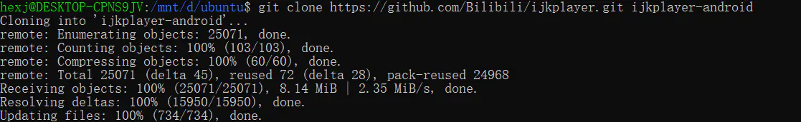
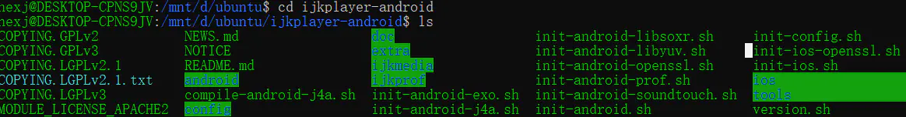
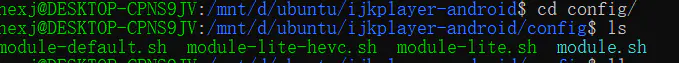
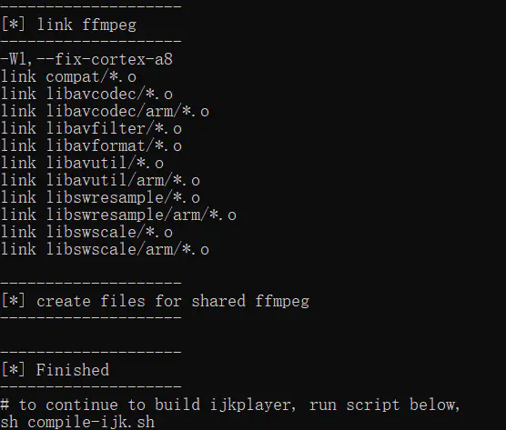
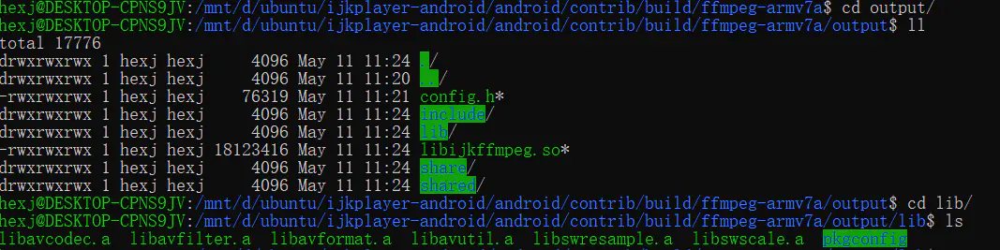
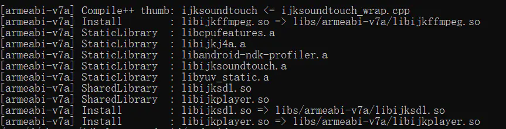
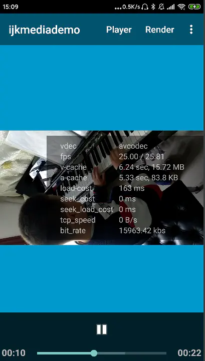

# Win10+WSL环境编译bilibili/ijkplayer源码

先谈一下遇到的问题，最棘手的问题就是wsl环境下  

ubuntu与win10的PATH环境变量是共享的，而在编译源码的时候用到NDK独立工具链（[NDK standalone toolchain,大概是因为坑太多，目前已被google弃用，想了解的同学可点击此链接查看官方文档](https://links.jianshu.com/go?to=https%3A%2F%2Fdeveloper.android.google.cn%2Fndk%2Fguides%2Fstandalone_toolchain)）在脚本中会去设置PATH环境变量，最后由于ubuntu的PATH环境变量共享了win10的值，导致编译失败。因为没遇到过此类问题因此耗费了一些时间，试了网上搜索的几种解决办法，最后通过修改注册表的方式解决了这个问题:

- *HKEY_CURRENT_USER\Software\Microsoft\Windows\CurrentVersion\Lxss{GUID}\Flags Flags从更改7为5.*
- *管理员运行powershell重启wsl 命令如下*

```undefined
net stop LxssManager 
net start LxssManager
```

言归正传，下面详细介绍下编译流程，流程可以归结为以下几个步骤：

- 配置android sdk及ndk路径
- 下载bilibili/ijkplayer源码
- 对FFmpeg进行配置
- 执行init_android.sh
- 编译FFmpeg
- 编译ijkplayer
- 使用ijkplayer库文件  
  其中第三步和第四步顺序可以调换，下面针对每一步的操作及结果进行详细的解说。

## 配置android sdk及ndk路径

NDK的版本要求在10~14之间，Android SDK的版本要求API 9~23(我实际用的是api 24也成功了)。  
在/etc/bash.bashrc中添加如下代码

```bash
# export ANDROID_SDK=<your sdk path>
# export ANDROID_NDK=<your ndk path>
```

## 下载bilibili/ijkplayer源码

从github网站克隆源码，由于公司网络环境不稳定可能会失败，建议通过pc连接手机热点下载（稳定，速度快，缺点是费流量）

```bash
git clone https://github.com/Bilibili/ijkplayer.git ijkplayer-android
cd ijkplayer-android
git checkout -B latest k0.8.8
```

出现下图提示时表示已经下载完成了。



获取源码成功

获取到的源码如下：



ijkplayer源码文件

## 执行init_android.sh脚本

该脚本的主要作用是获取ffmpeg、libyuv及soundtouch源码,并做一些初始化操作

```bash
hexj@DESKTOP-CPNS9JV:/mnt/d/ubuntu/ijkplayer-android$ ./init-android.sh
git version 2.25.1
== pull ffmpeg base ==
Cloning into 'extra/ffmpeg'...
remote: Enumerating objects: 539054, done.
remote: Counting objects: 100% (4/4), done.
remote: Compressing objects: 100% (4/4), done.
remote: Total 539054 (delta 0), reused 4 (delta 0), pack-reused 539050
Receiving objects: 100% (539054/539054), 203.51 MiB | 1.31 MiB/s, done.
Resolving deltas: 100% (418345/418345), done.
Updating files: 100% (6352/6352), done.
== pull ffmpeg fork armv5 ==
Cloning into 'android/contrib/ffmpeg-armv5'...
Updating files: 100% (6352/6352), done.
Enumerating objects: 539054, done.
Counting objects: 100% (539054/539054), done.
Delta compression using up to 8 threads
Compressing objects: 100% (119451/119451), done.
Writing objects: 100% (539054/539054), done.
Total 539054 (delta 418345), reused 539054 (delta 418345)
Updating files: 100% (1940/1940), done.
Switched to a new branch 'ijkplayer'
/mnt/d/ubuntu/ijkplayer-android
== pull ffmpeg fork armv7a ==
Cloning into 'android/contrib/ffmpeg-armv7a'...
Updating files: 100% (6352/6352), done.
Enumerating objects: 539054, done.
Counting objects: 100% (539054/539054), done.
Delta compression using up to 8 threads
Compressing objects: 100% (119451/119451), done.
Writing objects: 100% (539054/539054), done.
Total 539054 (delta 418345), reused 539054 (delta 418345)
Updating files: 100% (1940/1940), done.
Switched to a new branch 'ijkplayer'
/mnt/d/ubuntu/ijkplayer-android
== pull ffmpeg fork arm64 ==
Cloning into 'android/contrib/ffmpeg-arm64'...
Updating files: 100% (6352/6352), done.
Enumerating objects: 539054, done.
Counting objects: 100% (539054/539054), done.
Delta compression using up to 8 threads
Compressing objects: 100% (119451/119451), done.
Writing objects: 100% (539054/539054), done.
Total 539054 (delta 418345), reused 539054 (delta 418345)
Updating files: 100% (1940/1940), done.
Switched to a new branch 'ijkplayer'
/mnt/d/ubuntu/ijkplayer-android
== pull ffmpeg fork x86 ==
Cloning into 'android/contrib/ffmpeg-x86'...
Updating files: 100% (6352/6352), done.
Enumerating objects: 539054, done.
Counting objects: 100% (539054/539054), done.
Delta compression using up to 8 threads
Compressing objects: 100% (119451/119451), done.
Writing objects: 100% (539054/539054), done.
Total 539054 (delta 418345), reused 539054 (delta 418345)
Updating files: 100% (1940/1940), done.
Switched to a new branch 'ijkplayer'
/mnt/d/ubuntu/ijkplayer-android
== pull ffmpeg fork x86_64 ==
Cloning into 'android/contrib/ffmpeg-x86_64'...
Updating files: 100% (6352/6352), done.
Enumerating objects: 539054, done.
Counting objects: 100% (539054/539054), done.
Delta compression using up to 8 threads
Compressing objects: 100% (119451/119451), done.
Writing objects: 100% (539054/539054), done.
Total 539054 (delta 418345), reused 539054 (delta 418345)
Updating files: 100% (1940/1940), done.
Switched to a new branch 'ijkplayer'
/mnt/d/ubuntu/ijkplayer-android
== pull libyuv base ==
Cloning into 'extra/libyuv'...
remote: Enumerating objects: 12767, done.
remote: Total 12767 (delta 0), reused 0 (delta 0), pack-reused 12767
Receiving objects: 100% (12767/12767), 2.60 MiB | 95.00 KiB/s, done.
Resolving deltas: 100% (10540/10540), done.
== pull libyuv fork ==
Cloning into 'ijkmedia/ijkyuv'...
Enumerating objects: 12767, done.
Counting objects: 100% (12767/12767), done.
Delta compression using up to 8 threads
Compressing objects: 100% (2210/2210), done.
Writing objects: 100% (12767/12767), done.
Total 12767 (delta 10540), reused 12767 (delta 10540)
Branch 'ijk-r0.2.1-dev' set up to track remote branch 'ijk-r0.2.1-dev' from 'origin'.
Switched to a new branch 'ijk-r0.2.1-dev'
/mnt/d/ubuntu/ijkplayer-android
== pull soundtouch base ==
Cloning into 'extra/soundtouch'...
remote: Enumerating objects: 208, done.
remote: Total 208 (delta 0), reused 0 (delta 0), pack-reused 208
Receiving objects: 100% (208/208), 256.98 KiB | 143.00 KiB/s, done.
Resolving deltas: 100% (91/91), done.
== pull soundtouch fork ==
Cloning into 'ijkmedia/ijksoundtouch'...
Enumerating objects: 208, done.
Counting objects: 100% (208/208), done.
Delta compression using up to 8 threads
Compressing objects: 100% (105/105), done.
Writing objects: 100% (208/208), done.
Total 208 (delta 91), reused 208 (delta 91)
Branch 'ijk-r0.1.2-dev' set up to track remote branch 'ijk-r0.1.2-dev' from 'origin'.
Switched to a new branch 'ijk-r0.1.2-dev'
/mnt/d/ubuntu/ijkplayer-android
```

## 对FFmpeg进行配置

获取完ffmpeg源码之后不要着急进行编译，需要先对FFmpeg进行配置，进入config目录，可以看到此目录包含如下文件：



config文件

module-default.sh、module-lite-hevc.sh、module-lite.sh分别代表三种配置。简单解释一下这三种配置：  
default支持的视频格式较多，但是编出来的so文件会较大；lite支持较少的格式，但是so文件也较小；lite-hevc支持格式较少，同时支持h265。  
可以选择其中一个复制并另存为module.sh，默认为default,如果想改用module-lite配置代码如下：

```ruby
cd config
rm module.sh
ln -s module-lite.sh module.sh
```

## 编译FFmpeg

```bash
cd android/contrib
./compile-ffmpeg.sh clean
./compile-ffmpeg.sh armv7a
```

*./compile-ffmpeg.sh*后面为参数表示cpu架构，可以为armv5、 armv7a、 arm64、 x86、 x86_64等，all表示所有，我只编了armv7a。 当出现下图提示时表示FFmpeg编译成功：  



FFmpeg编译成功

编译成功后会在*android/contrib/build/ffmpeg-armv7a/output*目录下生成libijkplayer.so文件  



image.png

- ## 编译ijkplayer

```bash
cd ..
./compile-ijk.sh armv7a
```

编译成功后会在android/ijkplayer/ijkplayer-armv7a/src/main/libs/armeabi-v7a目录下同时生成libijkplayer.so、libijksdl.so两个so文件。



编译ijkplayer成功

至此，ijkplayer的编译工作已经完成了！下面就是如何使用编译出的so文件。

## 使用ijkplayer库文件

这一步可以在win10底下完成。通过android studio 导入android目录下的ijkplayer工程，修改gradle文件确保能够构建成功，然后编译并运行ijkplayer-example模块，安装成功后，选择一个视频文件，可以发现视频可以正常播放，没有卡顿并且音视频完全同步，简直666！



ijkplayer demo播放截图

作者：岁月神偷_4676  

链接：https://www.jianshu.com/p/ea33d3c782c5 
 
来源：简书  

著作权归作者所有。商业转载请联系作者获得授权，非商业转载请注明出处。
