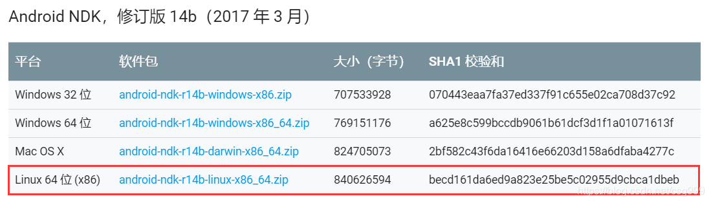
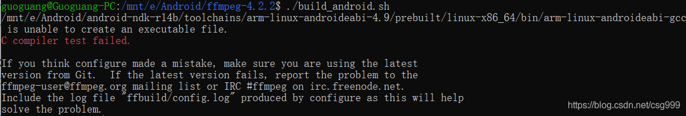
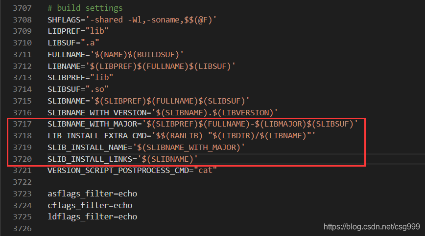
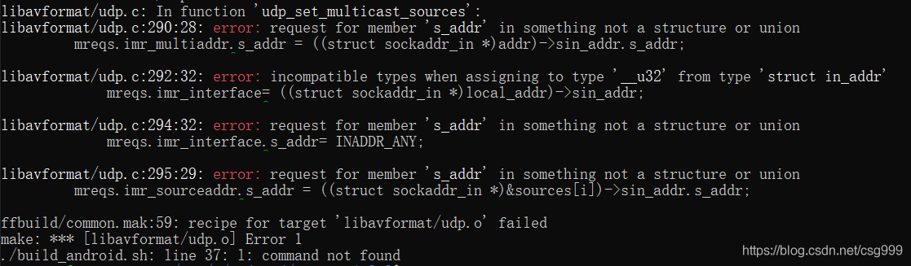
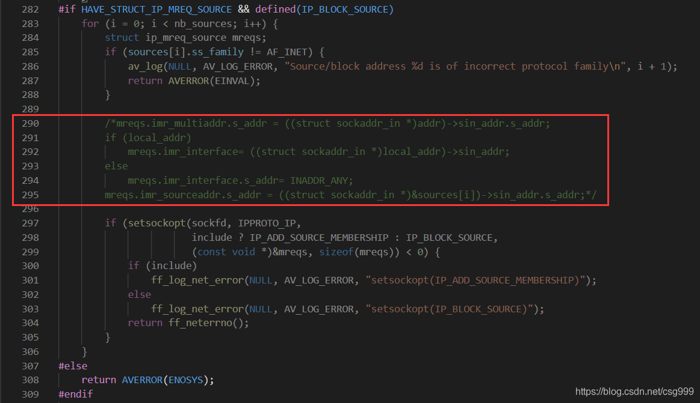

# Windows10 WSL NDK 编译 Android 版 ffmpeg 4.2.2 #


Android

专栏收录该内容

2 篇文章0 订阅

订阅专栏

## 前言 ##

- 由于刚开始研究，查了很多资料才成功
- 网上大多数材料都是基于 MinGW 编译的，搬到 WSL 上也踩了很多坑
- 本文基于 NDK 14b 版本编译，如需更新版本请更换编译脚本
- 支持 WSL 的 NDK r20b 编译脚本（不会遇到 udp.c 错误）
- 好吧，下面分享一下我的编译过程 ヾ(•ω•`)o

## Step 1. 下载所需文件 ##

**文件/环境准备：**

- WSL 子系统（教程很多，请自行安装）
- NDK 官方下载地址
- ffmpeg 源码 官方下载地址

**注意事项：**

NDK 本文使用 14b 版本因为后面的某些新版本移除了 gcc



NDK 要下载 Linux 64位 版本，不要下载 Windows 64位 版本，否则会找不到编译器，出现以下错误：

    /mnt/e/Android/android-ndk-r14b/toolchains/arm-linux-androideabi-4.9/prebuilt/linux-x86_64/bin/arm-linux-androideabi-gcc is unable to create an executable file.
    C compiler test failed.

最坑的是刚运行脚本的时候会等待一段时间执行 make clean 和 configure
然后一般人都不会眼睁睁的盯着，这个错误就出现在刚开始运行的时候
并且不会结束编译，只不过编译之后不生成 android 文件夹还不告诉你
感觉成功了啥错误没有，结果一顿折腾最后啥也没有。



## Step 2. 修改 configure ##

将 configure 文件中这部分内容

```
SLIBNAME_WITH_MAJOR='$(SLIBNAME).$(LIBMAJOR)'
LIB_INSTALL_EXTRA_CMD='$$(RANLIB)"$(LIBDIR)/$(LIBNAME)"'
SLIB_INSTALL_NAME='$(SLIBNAME_WITH_VERSION)'
SLIB_INSTALL_LINKS='$(SLIBNAME_WITH_MAJOR)$(SLIBNAME)'
```

替换成以下内容：

```
SLIBNAME_WITH_MAJOR='$(SLIBPREF)$(FULLNAME)-$(LIBMAJOR)$(SLIBSUF)'
LIB_INSTALL_EXTRA_CMD='$$(RANLIB)"$(LIBDIR)/$(LIBNAME)"'
SLIB_INSTALL_NAME='$(SLIBNAME_WITH_MAJOR)'
SLIB_INSTALL_LINKS='$(SLIBNAME)'
```

我这个版本（4.2.2）是 3717 行，搜索也可



## Step 3. 建立 build_android.sh ##

- 在 ffmpeg 源码根目录建立 build_android.sh
- 这个脚本网上有很多，我也不记得我的是哪里来的了
- 根据你的文件位置修改 NDK SYSROOT TOOLCHAIN TMPDIR

```
#!/bin/bash
# 清空上次编译
make clean
# 你的NDK路径
export NDK=/mnt/e/Android/android-ndk-r14b
# 设置你的android平台编译器的版本
export SYSROOT=$NDK/platforms/android-14/arch-arm
# 编译使用的toolchain
export TOOLCHAIN=$NDK/toolchains/arm-linux-androideabi-4.9/prebuilt/linux-x86_64
export CPU=arm
# 输出路径
export PREFIX=$(pwd)/android/$CPU
export ADDI_CFLAGS="-marm"
# 临时文件路径
export TMPDIR="/mnt/e/Android/ffmpegtemp"

./configure --target-os=linux \
--prefix=$PREFIX --arch=arm \
--disable-doc \
--enable-shared \
--disable-static \
--disable-x86asm \
--disable-symver \
--enable-gpl \
--disable-ffmpeg \
--disable-ffplay \
--disable-ffprobe \
--disable-doc \
--disable-symver \
--cross-prefix=$TOOLCHAIN/bin/arm-linux-androideabi- \
--enable-cross-compile \
--sysroot=$SYSROOT \
--extra-cflags="-Os -fpic $ADDI_CFLAGS" \
--extra-ldflags="$ADDI_LDFLAGS" \
$ADDITIONAL_CONFIGURE_FLAG

make
make install
```

**Tips：**

如果感觉编译太慢可以把倒数第二行 make 改为 make -j4 加速

## Step 4. 开始编译 ##

- 在 ffmpeg 源码根目录打开 wsl
- （简便方法：按住 Shift 右键–在此处打开 Linux Shell）
- 直接输入./build_android.sh 开始编译

## FAQs： ##

[0x01] udp.c 编译错误

```
libavformat/udp.c: In function 'udp_set_multicast_sources':
libavformat/udp.c:290:28: error: request for member 's_addr' in something not a structure or union
         mreqs.imr_multiaddr.s_addr = ((struct sockaddr_in *)addr)->sin_addr.s_addr;
                            ^
libavformat/udp.c:292:32: error: incompatible types when assigning to type '__u32' from type 'struct in_addr'
             mreqs.imr_interface= ((struct sockaddr_in *)local_addr)->sin_addr;
                                ^
libavformat/udp.c:294:32: error: request for member 's_addr' in something not a structure or union
             mreqs.imr_interface.s_addr= INADDR_ANY;
                                ^
libavformat/udp.c:295:29: error: request for member 's_addr' in something not a structure or union
         mreqs.imr_sourceaddr.s_addr = ((struct sockaddr_in *)&sources[i])->sin_addr.s_addr;
                             ^
ffbuild/common.mak:59: recipe for target 'libavformat/udp.o' failed
make: *** [libavformat/udp.o] Error 1
./build_android.sh: line 37: l: command not found
```



- 对于这个错误暂时没有找到合适的修改方法
- 可以通过注释掉报错源码解决该问题，使其不影响编译
- 位置：libavformat/udp.c 290-295行



[0x02] arm-linux-androideabi-pkg-config 警告

    WARNING: /mnt/e/Android/android-ndk-r14b/toolchains/arm-linux-androideabi-4.9/prebuilt/linux-x86_64/bin/arm-linux-androideabi-pkg-config not found, library detection may fail.

不影响编译，正常编译即可。

————————————————

版权声明：本文为CSDN博主「果光」的原创文章，遵循CC 4.0 BY-SA版权协议，转载请附上原文出处链接及本声明。

原文链接：https://blog.csdn.net/csg999/article/details/104214291