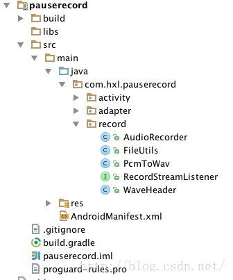
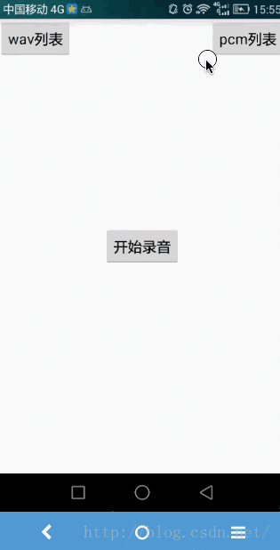

# 使用AudioRecord实现暂停录音功能 #

题外话：发现好久都没有上来写博文了，毕业设计加上公司暂时没有Android的项目做，只能去自学web上的知识，摸爬打滚到现在，花了一个多月时间根据公司的现有模板做了公司内部一个任务管理系统，感觉都是比较浅的知识，没什么可以写的。想到之前做的语音识别的项目，虽然现在没什么下文了，但是谁懂~~~将来呢？

言归正传，项目长这样子：



设计的思路：

由于自带的AudioRecord没有pauseRecord()方法，我把开始录音-->（暂停/继续录音）...-->停止录音叫做一次录音，点击一次暂停就会产生一个文件(.pcm)，将一次录音产生的所有文件名(.pcm)用一个list装起来，点击停止后将遍历list取得所有文件路径进行拼接。

由于考虑到以后可能要进行语音识别，所以对程序的灵活性和拓展性都做了相应的处理，可以通过setListener()监听录音的音频流和监听录音结束。

采用线程池对线程进行管理，减少系统开销。


对类的说明：

AudioRecorder：封装了录音的方法：创建录音对象、开始、暂停、停止、取消，使用静态枚举类Status来记录录音的状态。

FileUtils：文件工具类，用于文件路径的获取

PcmToWav：封装了将.pcm文件转化.wav文件的方法

WaveHeader： wav文件头

RecordStreamListener：监听录音音频流，用于拓展业务的处理


接下来是关键代码部分：

**1、AudioRecorder类：**


```
package com.hxl.pauserecord.record;
 
import android.media.AudioFormat;
import android.media.AudioRecord;
import android.media.MediaRecorder;
import android.text.TextUtils;
import android.util.Log;
 
import java.io.File;
import java.io.FileNotFoundException;
import java.io.FileOutputStream;
import java.io.IOException;
import java.util.ArrayList;
import java.util.List;
import java.util.concurrent.ExecutorService;
import java.util.concurrent.Executors;
 
/**
 * Created by HXL on 16/8/11.
 * 用于实现录音   暂停录音
 */
public class AudioRecorder {
    //音频输入-麦克风
    private final static int AUDIO_INPUT = MediaRecorder.AudioSource.MIC;
    //采用频率
    //44100是目前的标准，但是某些设备仍然支持22050，16000，11025
    //采样频率一般共分为22.05KHz、44.1KHz、48KHz三个等级
    private final static int AUDIO_SAMPLE_RATE = 16000;
    //声道 单声道
    private final static int AUDIO_CHANNEL = AudioFormat.CHANNEL_IN_MONO;
    //编码
    private final static int AUDIO_ENCODING = AudioFormat.ENCODING_PCM_16BIT;
    // 缓冲区字节大小
    private int bufferSizeInBytes = 0;
 
    //录音对象
    private AudioRecord audioRecord;
 
    //录音状态
    private Status status = Status.STATUS_NO_READY;
 
    //文件名
    private String fileName;
 
    //录音文件
    private List<String> filesName = new ArrayList<>();
 
    //线程池
    private ExecutorService mExecutorService;
 
    //录音监听
    private RecordStreamListener listener;
 
 
    public AudioRecorder() {
        mExecutorService = Executors.newCachedThreadPool();
    }
 
    /**
     * 创建录音对象
     */
    public void createAudio(String fileName, int audioSource, int sampleRateInHz, int channelConfig, int audioFormat) {
        // 获得缓冲区字节大小
        bufferSizeInBytes = AudioRecord.getMinBufferSize(sampleRateInHz,
                channelConfig, channelConfig);
        audioRecord = new AudioRecord(audioSource, sampleRateInHz, channelConfig, audioFormat, bufferSizeInBytes);
        this.fileName = fileName;
    }
 
    /**
     * 创建默认的录音对象
     *
     * @param fileName 文件名
     */
    public void createDefaultAudio(String fileName) {
        // 获得缓冲区字节大小
        bufferSizeInBytes = AudioRecord.getMinBufferSize(AUDIO_SAMPLE_RATE,
                AUDIO_CHANNEL, AUDIO_ENCODING);
        audioRecord = new AudioRecord(AUDIO_INPUT, AUDIO_SAMPLE_RATE, AUDIO_CHANNEL, AUDIO_ENCODING, bufferSizeInBytes);
        this.fileName = fileName;
        status = Status.STATUS_READY;
    }
 
 
    /**
     * 开始录音
     *
     */
    public void startRecord() {
 
        if (status == Status.STATUS_NO_READY||audioRecord==null) {
            throw new IllegalStateException("录音尚未初始化,请检查是否禁止了录音权限~");
        }
        if (status == Status.STATUS_START) {
            throw new IllegalStateException("正在录音");
        }
        Log.d("AudioRecorder", "===startRecord===" + audioRecord.getState());
        audioRecord.startRecording();
 
        String currentFileName = fileName;
        if (status == Status.STATUS_PAUSE) {
            //假如是暂停录音 将文件名后面加个数字,防止重名文件内容被覆盖
            currentFileName += filesName.size();
 
        }
        filesName.add(currentFileName);
 
        final String finalFileName=currentFileName;
        //将录音状态设置成正在录音状态
        status = Status.STATUS_START;
 
        //使用线程池管理线程
        mExecutorService.execute(new Runnable() {
            @Override
            public void run() {
                writeDataTOFile(finalFileName);
            }
        });
    }
 
    /**
     * 暂停录音
     */
    public void pauseRecord() {
        Log.d("AudioRecorder", "===pauseRecord===");
        if (status != Status.STATUS_START) {
            throw new IllegalStateException("没有在录音");
        } else {
            audioRecord.stop();
            status = Status.STATUS_PAUSE;
        }
    }
 
    /**
     * 停止录音
     */
    public void stopRecord() {
        Log.d("AudioRecorder", "===stopRecord===");
        if (status == Status.STATUS_NO_READY || status == Status.STATUS_READY) {
            throw new IllegalStateException("录音尚未开始");
        } else {
            audioRecord.stop();
            status = Status.STATUS_STOP;
            release();
        }
    }
 
    /**
     * 释放资源
     */
    public void release() {
        Log.d("AudioRecorder", "===release===");
        //假如有暂停录音
        try {
            if (filesName.size() > 0) {
                List<String> filePaths = new ArrayList<>();
                for (String fileName : filesName) {
                    filePaths.add(FileUtils.getPcmFileAbsolutePath(fileName));
                }
                //清除
                filesName.clear();
                //将多个pcm文件转化为wav文件
                mergePCMFilesToWAVFile(filePaths);
 
            } else {
                //这里由于只要录音过filesName.size都会大于0,没录音时fileName为null
                //会报空指针 NullPointerException
                // 将单个pcm文件转化为wav文件
                //Log.d("AudioRecorder", "=====makePCMFileToWAVFile======");
                //makePCMFileToWAVFile();
            }
        } catch (IllegalStateException e) {
            throw new IllegalStateException(e.getMessage());
        }
 
        if (audioRecord != null) {
            audioRecord.release();
            audioRecord = null;
        }
 
        status = Status.STATUS_NO_READY;
    }
 
    /**
     * 取消录音
     */
    public void canel() {
        filesName.clear();
        fileName = null;
        if (audioRecord != null) {
            audioRecord.release();
            audioRecord = null;
        }
 
        status = Status.STATUS_NO_READY;
    }
 
 
    /**
     * 将音频信息写入文件
     *
     */
    private void writeDataTOFile(String currentFileName) {
        // new一个byte数组用来存一些字节数据，大小为缓冲区大小
        byte[] audiodata = new byte[bufferSizeInBytes];
 
        FileOutputStream fos = null;
        int readsize = 0;
        try {
            File file = new File(FileUtils.getPcmFileAbsolutePath(currentFileName));
            if (file.exists()) {
                file.delete();
            }
            fos = new FileOutputStream(file);// 建立一个可存取字节的文件
        } catch (IllegalStateException e) {
            Log.e("AudioRecorder", e.getMessage());
            throw new IllegalStateException(e.getMessage());
        } catch (FileNotFoundException e) {
            Log.e("AudioRecorder", e.getMessage());
 
        }
        while (status == Status.STATUS_START) {
            readsize = audioRecord.read(audiodata, 0, bufferSizeInBytes);
            if (AudioRecord.ERROR_INVALID_OPERATION != readsize && fos != null) {
                try {
                    fos.write(audiodata);
                    if (listener != null) {
                        //用于拓展业务
                        listener.onRecording(audiodata, 0, audiodata.length);
                    }
                } catch (IOException e) {
                    Log.e("AudioRecorder", e.getMessage());
                }
            }
        }
        if (listener != null) {
            listener.finishRecord();
        }
        try {
            if (fos != null) {
                fos.close();// 关闭写入流
            }
        } catch (IOException e) {
            Log.e("AudioRecorder", e.getMessage());
        }
    }
 
    /**
     * 将pcm合并成wav
     *
     * @param filePaths
     */
    private void mergePCMFilesToWAVFile(final List<String> filePaths) {
        mExecutorService.execute(new Runnable() {
            @Override
            public void run() {
                if (PcmToWav.mergePCMFilesToWAVFile(filePaths, FileUtils.getWavFileAbsolutePath(fileName))) {
                    //操作成功
                } else {
                    //操作失败
                    Log.e("AudioRecorder", "mergePCMFilesToWAVFile fail");
                    throw new IllegalStateException("mergePCMFilesToWAVFile fail");
                }
            }
        });
    }
 
    /**
     * 将单个pcm文件转化为wav文件
     */
    private void makePCMFileToWAVFile() {
        mExecutorService.execute(new Runnable() {
            @Override
            public void run() {
                if (PcmToWav.makePCMFileToWAVFile(FileUtils.getPcmFileAbsolutePath(fileName), FileUtils.getWavFileAbsolutePath(fileName), true)) {
                    //操作成功
                } else {
                    //操作失败
                    Log.e("AudioRecorder", "makePCMFileToWAVFile fail");
                    throw new IllegalStateException("makePCMFileToWAVFile fail");
                }
            }
        });
    }
 
 
    /**
     * 录音对象的状态
     */
    public enum Status {
        //未开始
        STATUS_NO_READY,
        //预备
        STATUS_READY,
        //录音
        STATUS_START,
        //暂停
        STATUS_PAUSE,
        //停止
        STATUS_STOP
    }
 
    /**
     * 获取录音对象的状态
     *
     * @return
     */
    public Status getStatus() {
        return status;
    }
 
    /**
     * 获取本次录音文件的个数
     *
     * @return
     */
    public int getPcmFilesCount() {
        return filesName.size();
    }
 
 
    public RecordStreamListener getListener() {
        return listener;
    }
 
    public void setListener(RecordStreamListener listener) {
        this.listener = listener;
    }
 
}
```

**2：PcmToWav**

 

```
package com.hxl.pauserecord.record;
 
import android.util.Log;
 
import java.io.BufferedInputStream;
import java.io.BufferedOutputStream;
import java.io.File;
import java.io.FileInputStream;
import java.io.FileNotFoundException;
import java.io.FileOutputStream;
import java.io.IOException;
import java.io.InputStream;
import java.io.OutputStream;
import java.text.SimpleDateFormat;
import java.util.ArrayList;
import java.util.Date;
import java.util.List;
 
/**
 * Created by HXL on 16/8/11.
 * 将pcm文件转化为wav文件
 */
public class PcmToWav {
    /**
     * 合并多个pcm文件为一个wav文件
     *
     * @param filePathList    pcm文件路径集合
     * @param destinationPath 目标wav文件路径
     * @return true|false
     */
    public static boolean mergePCMFilesToWAVFile(List<String> filePathList,
                                                 String destinationPath) {
        File[] file = new File[filePathList.size()];
        byte buffer[] = null;
 
        int TOTAL_SIZE = 0;
        int fileNum = filePathList.size();
 
        for (int i = 0; i < fileNum; i++) {
            file[i] = new File(filePathList.get(i));
            TOTAL_SIZE += file[i].length();
        }
 
        // 填入参数，比特率等等。这里用的是16位单声道 8000 hz
        WaveHeader header = new WaveHeader();
        // 长度字段 = 内容的大小（TOTAL_SIZE) +
        // 头部字段的大小(不包括前面4字节的标识符RIFF以及fileLength本身的4字节)
        header.fileLength = TOTAL_SIZE + (44 - 8);
        header.FmtHdrLeth = 16;
        header.BitsPerSample = 16;
        header.Channels = 2;
        header.FormatTag = 0x0001;
        header.SamplesPerSec = 8000;
        header.BlockAlign = (short) (header.Channels * header.BitsPerSample / 8);
        header.AvgBytesPerSec = header.BlockAlign * header.SamplesPerSec;
        header.DataHdrLeth = TOTAL_SIZE;
 
        byte[] h = null;
        try {
            h = header.getHeader();
        } catch (IOException e1) {
            Log.e("PcmToWav", e1.getMessage());
            return false;
        }
 
        if (h.length != 44) // WAV标准，头部应该是44字节,如果不是44个字节则不进行转换文件
            return false;
 
        //先删除目标文件
        File destfile = new File(destinationPath);
        if (destfile.exists())
            destfile.delete();
 
        //合成所有的pcm文件的数据，写到目标文件
        try {
            buffer = new byte[1024 * 4]; // Length of All Files, Total Size
            InputStream inStream = null;
            OutputStream ouStream = null;
 
            ouStream = new BufferedOutputStream(new FileOutputStream(
                    destinationPath));
            ouStream.write(h, 0, h.length);
            for (int j = 0; j < fileNum; j++) {
                inStream = new BufferedInputStream(new FileInputStream(file[j]));
                int size = inStream.read(buffer);
                while (size != -1) {
                    ouStream.write(buffer);
                    size = inStream.read(buffer);
                }
                inStream.close();
            }
            ouStream.close();
        } catch (FileNotFoundException e) {
            Log.e("PcmToWav", e.getMessage());
            return false;
        } catch (IOException ioe) {
            Log.e("PcmToWav", ioe.getMessage());
            return false;
        }
        clearFiles(filePathList);
        Log.i("PcmToWav", "mergePCMFilesToWAVFile  success!" + new SimpleDateFormat("yyyy-MM-dd hh:mm").format(new Date()));
        return true;
 
    }
 
    /**
     * 将一个pcm文件转化为wav文件
     *
     * @param pcmPath         pcm文件路径
     * @param destinationPath 目标文件路径(wav)
     * @param deletePcmFile   是否删除源文件
     * @return
     */
    public static boolean makePCMFileToWAVFile(String pcmPath, String destinationPath, boolean deletePcmFile) {
        byte buffer[] = null;
        int TOTAL_SIZE = 0;
        File file = new File(pcmPath);
        if (!file.exists()) {
            return false;
        }
        TOTAL_SIZE = (int) file.length();
        // 填入参数，比特率等等。这里用的是16位单声道 8000 hz
        WaveHeader header = new WaveHeader();
        // 长度字段 = 内容的大小（TOTAL_SIZE) +
        // 头部字段的大小(不包括前面4字节的标识符RIFF以及fileLength本身的4字节)
        header.fileLength = TOTAL_SIZE + (44 - 8);
        header.FmtHdrLeth = 16;
        header.BitsPerSample = 16;
        header.Channels = 2;
        header.FormatTag = 0x0001;
        header.SamplesPerSec = 8000;
        header.BlockAlign = (short) (header.Channels * header.BitsPerSample / 8);
        header.AvgBytesPerSec = header.BlockAlign * header.SamplesPerSec;
        header.DataHdrLeth = TOTAL_SIZE;
 
        byte[] h = null;
        try {
            h = header.getHeader();
        } catch (IOException e1) {
            Log.e("PcmToWav", e1.getMessage());
            return false;
        }
 
        if (h.length != 44) // WAV标准，头部应该是44字节,如果不是44个字节则不进行转换文件
            return false;
 
        //先删除目标文件
        File destfile = new File(destinationPath);
        if (destfile.exists())
            destfile.delete();
 
        //合成所有的pcm文件的数据，写到目标文件
        try {
            buffer = new byte[1024 * 4]; // Length of All Files, Total Size
            InputStream inStream = null;
            OutputStream ouStream = null;
 
            ouStream = new BufferedOutputStream(new FileOutputStream(
                    destinationPath));
            ouStream.write(h, 0, h.length);
            inStream = new BufferedInputStream(new FileInputStream(file));
            int size = inStream.read(buffer);
            while (size != -1) {
                ouStream.write(buffer);
                size = inStream.read(buffer);
            }
            inStream.close();
            ouStream.close();
        } catch (FileNotFoundException e) {
            Log.e("PcmToWav", e.getMessage());
            return false;
        } catch (IOException ioe) {
            Log.e("PcmToWav", ioe.getMessage());
            return false;
        }
        if (deletePcmFile) {
            file.delete();
        }
        Log.i("PcmToWav", "makePCMFileToWAVFile  success!" + new SimpleDateFormat("yyyy-MM-dd hh:mm").format(new Date()));
        return true;
 
    }
 
    /**
     * 清除文件
     *
     * @param filePathList
     */
    private static void clearFiles(List<String> filePathList) {
        for (int i = 0; i < filePathList.size(); i++) {
            File file = new File(filePathList.get(i));
            if (file.exists()) {
                file.delete();
            }
        }
    }
 
}
```

**3、WaveHeader类：**

 

```
package com.hxl.pauserecord.record;
 
import java.io.ByteArrayOutputStream;
import java.io.IOException;
 
/**
 * Created by HXL on 16/3/9.
 * wav文件头
 */
public class WaveHeader {
    public final char fileID[] = {'R', 'I', 'F', 'F'};
    public int fileLength;
    public char wavTag[] = {'W', 'A', 'V', 'E'};;
    public char FmtHdrID[] = {'f', 'm', 't', ' '};
    public int FmtHdrLeth;
    public short FormatTag;
    public short Channels;
    public int SamplesPerSec;
    public int AvgBytesPerSec;
    public short BlockAlign;
    public short BitsPerSample;
    public char DataHdrID[] = {'d','a','t','a'};
    public int DataHdrLeth;
 
    public byte[] getHeader() throws IOException {
        ByteArrayOutputStream bos = new ByteArrayOutputStream();
        WriteChar(bos, fileID);
        WriteInt(bos, fileLength);
        WriteChar(bos, wavTag);
        WriteChar(bos, FmtHdrID);
        WriteInt(bos,FmtHdrLeth);
        WriteShort(bos,FormatTag);
        WriteShort(bos,Channels);
        WriteInt(bos,SamplesPerSec);
        WriteInt(bos,AvgBytesPerSec);
        WriteShort(bos,BlockAlign);
        WriteShort(bos,BitsPerSample);
        WriteChar(bos,DataHdrID);
        WriteInt(bos,DataHdrLeth);
        bos.flush();
        byte[] r = bos.toByteArray();
        bos.close();
        return r;
    }
 
    private void WriteShort(ByteArrayOutputStream bos, int s) throws IOException {
        byte[] mybyte = new byte[2];
        mybyte[1] =(byte)( (s << 16) >> 24 );
        mybyte[0] =(byte)( (s << 24) >> 24 );
        bos.write(mybyte);
    }
 
 
    private void WriteInt(ByteArrayOutputStream bos, int n) throws IOException {
        byte[] buf = new byte[4];
        buf[3] =(byte)( n >> 24 );
        buf[2] =(byte)( (n << 8) >> 24 );
        buf[1] =(byte)( (n << 16) >> 24 );
        buf[0] =(byte)( (n << 24) >> 24 );
        bos.write(buf);
    }
 
    private void WriteChar(ByteArrayOutputStream bos, char[] id) {
        for (int i=0; i<id.length; i++) {
            char c = id[i];
            bos.write(c);
        }
    }
}
```

接下来是效果图。。。个人为人做APP界面一定要美观，而且要非常美观，不然谁会用你的东西！so~~




好吧，请大家撇开UI看功能~正如预期的一样，每点击暂停一次会生成一个pcm文件，当点击停止的时候，将所有的录音整合成一个可播放的.wav文件


接下来，项目源码：[点击下载](http://download.csdn.net/detail/imhxl/9601867) 

结语：

有什么写得不对，或者可以优化的地方，欢迎大家指正交流，谢谢大家~~

————————————————

版权声明：本文为CSDN博主「imhxl」的原创文章，遵循CC 4.0 BY-SA版权协议，转载请附上原文出处链接及本声明。

原文链接：https://blog.csdn.net/imhxl/article/details/52190451