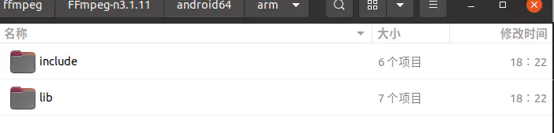

# 安卓ffmpeg开发（一）编译ffmpeg #

如题，想要进行ffmepg开发，首先，建议开发者自行编译一次开发所需的so库文件。
本次编译，博主用的主要是ubuntu系统进行编译，下面开始介绍编译的流程：

**环境准备：**

（1）ndk14版本，注意ndk版本一定要选择正确，否则会导致编译失败，之前选的是18版本，导致编译失败了。这里下载ndk后，配置一下etc/profile文件即可，截图如下：


ndk环境配置如下图

（2）准备好jdk环境，下载jdk for linux版本后，解压到相关目录，然后配置一下/etc/profile即可。


jdk配置

（3）补充，每次修改/etc/profile后，即可使用source /etc/profile让修改生效。

（4）ffmpeg下载。建议不下最新版本。博主这里下的是3点多的版本。

[ffmpeg下载地址](https://links.jianshu.com/go?to=http%3A%2F%2Fwww.ffmpeg.org%2Fdownload.html)

**编译**

（1）修改配置文件
需要先修改ffmpeg目录下的configure文件。定位到
相关位置并修改：


configure修改截图

（2）新建一个编译脚本文件，内容如下图：

```
#!/bin/bash
NDK=/home/lizhengting/software/android/ndk/android-ndk-r14b
SYSROOT=${NDK}/platforms/android-9/arch-arm
TOOLCHAIN=${NDK}/toolchains/arm-linux-androideabi-4.9/prebuilt/linux-x86_64
function build_so
{
./configure \
--prefix=$PREFIX \
--enable-shared \
--disable-static \
--disable-doc \
--disable-ffmpeg \
--disable-ffplay \
--disable-ffprobe \
--disable-ffserver \
--disable-avdevice \
--disable-doc \
--disable-symver \
--cross-prefix=${TOOLCHAIN}/bin/arm-linux-androideabi- \
--target-os=android \
--arch=arm \
--enable-cross-compile \
--sysroot=$SYSROOT \
--extra-cflags="-Os -fpic $ADDI_CFLAGS" \
--extra-ldflags="$ADDI_LDFLAGS" \
$ADDITIONAL_CONFIGURE_FLAG
make clean
make
make install
}
CPU=arm
PREFIX=./android64/$CPU
ADDI_CFLAGS="-marm"
build_so
```

注意：

    （1）--disable--ffserver这句，在编译时，报找不到目录错误可以增加
    （2）对于--target--os这里写的是android
    （3）对于相关的目录，记得检查清楚，注意空格

然后使用 ./ 命令执行脚本文件，执行的时候，注意权限问题。

最后编译完成，就会在对于的目录生成相关的文件，截图如下：



生效文件的目录

其中:include是生成的头文件，lib是生成的so库。

写在最后，对于编译报错，一般情况都是脚本文件空格，和ndk版本过高导致的，这里建议用ndk14就好。

编译生成文件link：

链接：https://pan.baidu.com/s/12zszbhd3S3YBD4E5sT3PGg

提取码：id7i

复制这段内容后打开百度网盘手机App，操作更方便哦

[下载](./ffmpeg/ffmpeg_so.zip)

that's all------------------------------------------------------------------------------------

作者：motosheep

链接：https://www.jianshu.com/p/4a67c4522c72

来源：简书

著作权归作者所有。商业转载请联系作者获得授权，非商业转载请注明出处。