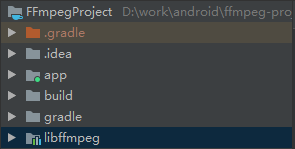
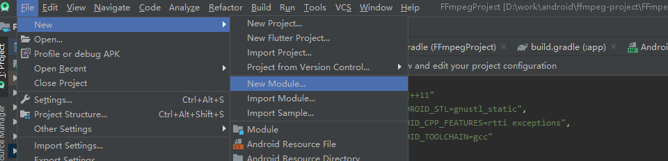
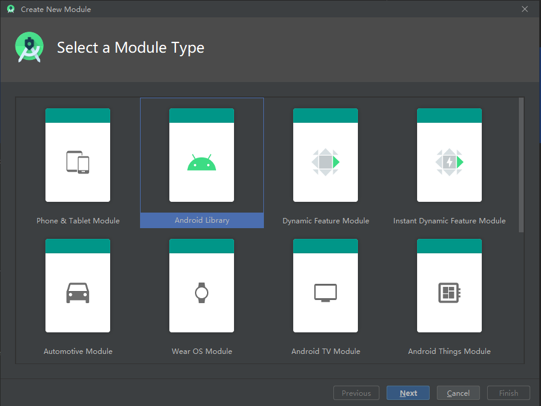
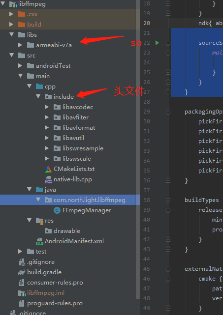

# 安卓ffmpeg开发（二）androidstudio导入ffmpeg #

本章节将会讲述如何导入ffmpeg到一个androidstudio项目中。

知识回顾：

（一）ffmpeg编译

链接包含相关编译生成的文件

本次演示，ffmpeg将会以module的方式导入到androidstudio的项目中

开发工具：androidstudio 3.6 + ndk14

具体的项目结构如下图：



app–主项目

libffmpeg–ffmpeg的module
###开始发车：
##

**（一）创建一个module**

点击androidstudio的file，然后选择new module即可创建一个module，具体如下：





然后点击若干个下一步，即可创建完成。

最后在主项目使用api project(":xxxx")即可依赖完成。


**（二）导入相关文件到module**

相关文件有编译生成的so，还有编译生成的头文件。

module的整体结构如下图：




    注意：项目结构的不一样，cmakelists的文件编写也会不一样，不要盲目copy网上资料，要学会自己理解项目结构以及cmakelists.txt的编写。


    注意：include下头文件之间相互引用的问题，在用到的时候，相关头文件引入路径请做修改。

对于native-lib.cpp文件的编写，这里仅仅使用了获取版本号的方法作为实践依据。具体代码如下：

```
#include <jni.h>
#include <string>

extern "C" {
#include "include/libavutil/avutil.h"
}


extern "C"
JNIEXPORT jstring JNICALL
Java_com_north_light_libffmpeg_FFmpegManager_getAVVersion(JNIEnv *env, jobject thiz) {
    return env->NewStringUTF(av_version_info());
}
```

关于函数命名，是java+包名+函数名字进行实现，涉及了jni相关经验。该navite方法对应java层的实现代码（FFmpegManager）如下：

```
package com.north.light.libffmpeg;

import java.io.Serializable;

/**
 * Created by lzt
 * time 2021/6/21 18:26
 *
 * @author lizhengting
 * 描述：ffmpeg manager
 */
public class FFmpegManager implements Serializable {

    static {
        System.loadLibrary("native-lib");
    }

    private static class SingleHolder {
        static FFmpegManager mInstance = new FFmpegManager();
    }

    public static FFmpegManager getInstance() {
        return SingleHolder.mInstance;
    }

    public native String getAVVersion();
}
```

其中，getAVVersion()方法就是对应的native-lib.cpp文件中的方法。

其中，使用static代码块的形式导入生成的so文件

```
  static {
        System.loadLibrary("native-lib");
    }
```

cmakelists.txt文件的编写代码如下图：

```
# For more information about using CMake with Android Studio, read the
# documentation: https://d.android.com/studio/projects/add-native-code.html

# Sets the minimum version of CMake required to build the native library.

cmake_minimum_required(VERSION 3.10.2)

add_library( # Sets the name of the library.
        native-lib  #加载so的名字
        SHARED
        native-lib.cpp)

find_library( # Sets the name of the path variable.
        log-lib
        log)

set(FF ${CMAKE_CURRENT_SOURCE_DIR}/../../../libs)
add_library(avcodec SHARED IMPORTED)
add_library(avformat SHARED IMPORTED)
add_library(avutil SHARED IMPORTED)
add_library(swscale SHARED IMPORTED)
add_library(swresample SHARED IMPORTED)
set_target_properties(avcodec PROPERTIES IMPORTED_LOCATION ${FF}/${ANDROID_ABI}/libavcodec.so)
set_target_properties(avformat PROPERTIES IMPORTED_LOCATION ${FF}/${ANDROID_ABI}/libavformat.so)
set_target_properties(avutil PROPERTIES IMPORTED_LOCATION ${FF}/${ANDROID_ABI}/libavutil.so)
set_target_properties(swscale PROPERTIES IMPORTED_LOCATION ${FF}/${ANDROID_ABI}/libswscale.so)
set_target_properties(swresample PROPERTIES IMPORTED_LOCATION ${FF}/${ANDROID_ABI}/libswresample.so)

target_include_directories(native-lib PRIVATE
        src/main/cpp/include)


target_link_libraries( # Specifies the target library.
        native-lib
        avcodec
        avformat
        avutil
        swscale
        swresample
        ${log-lib})
```

最后，就是附上build.gradle的代码：

```
apply plugin: 'com.android.library'

android {
    compileSdkVersion 30
    buildToolsVersion "30.0.3"

    defaultConfig {
        minSdkVersion 16
        targetSdkVersion 30
        versionCode 1
        versionName "1.0"
        externalNativeBuild {
            cmake {
                cppFlags "-std=c++11"
                arguments "-DANDROID_STL=gnustl_static",
                        "-DANDROID_CPP_FEATURES=rtti exceptions",
                        "-DANDROID_TOOLCHAIN=gcc"
            }
        }
        ndk{ abiFilters 'armeabi-v7a'}//此处要和你编译的处理器版本号一致

        sourceSets {
            main {
                jniLibs.srcDirs = ['libs']
            }
        }
    }

    packagingOptions {
        pickFirst 'lib/armeabi-v7a/libavcodec.so'
        pickFirst 'lib/armeabi-v7a/libavfilter.so'
        pickFirst 'lib/armeabi-v7a/libavformat.so'
        pickFirst 'lib/armeabi-v7a/libavutil.so'
        pickFirst 'lib/armeabi-v7a/libswresample.so'
        pickFirst 'lib/armeabi-v7a/libswscale.so'
    }

    buildTypes {
        release {
            minifyEnabled false
            proguardFiles getDefaultProguardFile('proguard-android-optimize.txt'), 'proguard-rules.pro'
        }
    }

    externalNativeBuild {
        cmake {
            path "src/main/cpp/CMakeLists.txt"
            version "3.10.2"
        }
    }
    compileOptions {
        sourceCompatibility JavaVersion.VERSION_1_8
        targetCompatibility JavaVersion.VERSION_1_8
    }
}

dependencies {
    implementation fileTree(dir: 'libs', include: ['*.jar'])

    implementation 'androidx.appcompat:appcompat:1.0.2'
    testImplementation 'junit:junit:4.12'
    androidTestImplementation 'androidx.test.ext:junit:1.1.1'
    androidTestImplementation 'androidx.test.espresso:espresso-core:3.2.0'
}
```

其中ndk，sourceSets，packaginOptions，以及externalNativeBuild的配置是要留意的。

that’s all-------------------------------------------------------------------------------------------------------------------------

————————————————

版权声明：本文为CSDN博主「motosheep」的原创文章，遵循CC 4.0 BY-SA版权协议，转载请附上原文出处链接及本声明。

原文链接：https://blog.csdn.net/motosheep/article/details/118611832